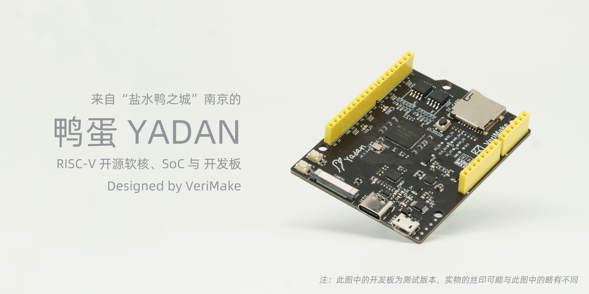

# YADAN's Documentation  
  
中文版 (zh_CN):   
  
点击 [此处](http://docs.yadanboard.com/) 可以阅读鸭蛋的文档。  
  
## 介绍  
  
  
  
YADAN 项目包含 YADAN Core、YADAN SoC、YADAN Board，分别是 RISC-V 指令集的开源 CPU Core、开源 SoC、开源开发板。YADAN Board 是一块核心为 Anlogic FPGA 的可编程硬件设计学习平台，我们可在上边部署一颗 YADAN Core 组成的 YADAN SoC，帮助我们从嵌入式软件一直学习到数字系统和计算机架构。  
  
如果您在使用 YADAN 的过程中遇到问题，欢迎在 [VeriMake 论坛](https://www.verimake.com/) 上参与讨论。如果发现文档中存在问题，欢迎在 [这个贴子](https://verimake.com/topics/269/) 下留言讨论。  
  
点击 [此处](http://docs.yadanboard.com/) 可以阅读鸭蛋的文档。  
  
## 版本更新日志  
  
| 日期               | 内容                                                               |
| ------------------ | ------------------------------------------------------------------ |
| 2021 年 8 月 23 日 | 创建了这个 Read the Docs 文档                                      |
| 2021 年 9 月 3 日  | 把文档更改成了鸭蛋配色                                             |
| 2021 年 9 月 6 日  | 给文档配置了域名 [docs.yadanboard.com](http://docs.yadanboard.com) |
| 2021 年 10 月 8 日 | 发布好了第一个版本的所有内容                                       |
