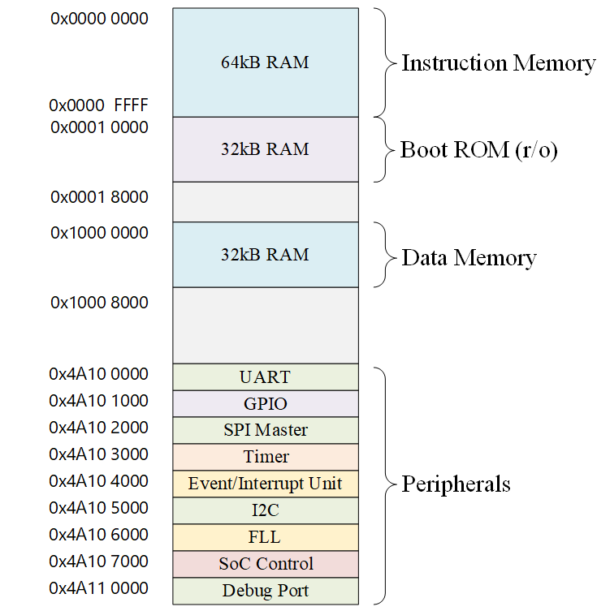
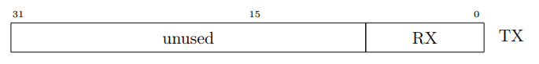
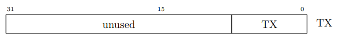
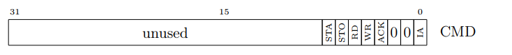
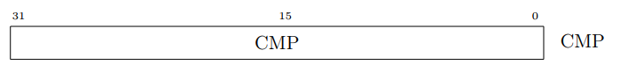

# 已适配的 SoC 的介绍  
  
## YADAN Core 内核的 YADAN SoC  
### YADAN 项目的简介  
YADAN 项目包含 YADAN Core、YADAN SoC、YADAN Board，分别是 RISC-V 指令集的 CPU 内核、SoC、开发板。这套组合支持电子与计算机相关专业的学生全流程地从嵌入式软件一直学习到数字系统和计算机架构。  
  
YADAN SoC 是 [VeriMake](https://www.verimake.com/) 设计的一款 SoC，它搭载一颗 RISC-V 指令集的 YADAN Core，开发者可灵活配置自定义的外设。  
  
### YADAN SoC 的概况  
  
以 RISC-V 指令集的 YADAN Core 为内核的 YADAN SoC 默认配置的结构如图 2.1.1 所示，内核通过 AHB 与 APB 总线与外设相连，默认包含有 GPIO、UART、SPI 等外设。  
  
**
  
图 2.1.1 YADAN SoC 默认配置的结构图
**
  
YADAN SoC 默认拥有如下的资源：  
&nbsp;&nbsp;(1) Instruction RAM 64KB  
&nbsp;&nbsp;(2) Boot ROM 32KB  
&nbsp;&nbsp;(3) Data RAM 32KB  
&nbsp;&nbsp;(4) GPIO 16个  
&nbsp;&nbsp;&nbsp;&nbsp;其中 0 ~ 13 号引脚与 Arduino UNO 的布局兼容，14 号引脚连接标号为 DONE 的 LED，15 号引脚连接标号为 K_50 的按键  
&nbsp;&nbsp;(5) 定时器 2个  
&nbsp;&nbsp;(6) UART 1个  
&nbsp;&nbsp;(7) I²C 1个 *(将在后续版本加入，此版本暂时不包含)*  
&nbsp;&nbsp;(8) SPI Master 4个  
&nbsp;&nbsp;&nbsp;&nbsp;默认实例化其中 1 个，连接用户 SPI Flash（其中地址 0x0000 ~ 0xFFFF 用于存放用户程序，地址 0x10000 存放目前在低 64KB 空间中存放的程序大小，其余空间可供用户使用），另外 3 个可供用户自定义使用  
&nbsp;&nbsp;(9) 支持中断控制器控制系统总中断  
  
  
### 本实验采用的 SoC 的内存地址分配  
  
**
  
图 2.1.2 YADAN SoC 的内存地址分配
**
  
地址为 0x0000_0000 ~ 0x0000_FFFF 的存储空间是用户编写的程序存放的空间，称为指令存储器 (Instruction Memory)，大小为 64KB。这部分空间在 FPGA 中是使用 RAM 来构成的，掉电后数据会丢失，所以我们的程序可以存放在 FPGA 外部的用户 Flash 中，Flash 掉电非易失。但是，CPU 核的指令接口是连接这 FPGA 中的 RAM 的，所以 SoC 通常都会拥有一块掉电非易失的存储器来存放内核启动时候开始做的一些工作，比如将片外 Flash 的程序加载到内部的指令存储器中，这些工作被称为 Bootloader。我们的 Bootloader 程序存放在地址为 0x0001_0000 ~ 0x0001_07FF 的 Boot ROM 中，大小为 32KB。Bootloader 主要执行的工作为：如果在 CPU 启动时串口有下载程序的请求，就将串口发送来的程序同时存放到指令存储器和 Flash 对应的位置上，完成后复位程序计数器到指令存储器启动地址再开始执行程序；如果在 CPU 启动时没有收到下载程序的请求，就会将存放在 Flash 中的程序加载到指令存储器中，再复位程序计数器到指令存储器启动地址再开始执行程序。地址为 0x0010_0000 ~ 0x0010_07FF 的存储空间为数据存储器 (Data Memory)，大小为32KB。  
  
地址为 0x4A10_0000 ~ 0x4A11_1000 的存储空间被分配给外设，每 4KB 地址对应一个外设，即每个外设可拥有 4KB 的存储空间，主要用来存放各个外设所需要的寄存器。理论上算，每个外设最多可以拥有 32 位的寄存器 1024 个，当然在实际使用中极少有情况需要这么多，所以这样分配地址在绝大多数情况是足够的。  
  
### 中断向量表  
  
YADAN SoC 支持 9 个外部中断，3 个异常，在每个中断和异常发生时，内核会跳转到相应的程序地址里开始执行中断 / 异常处理程序。表 2.1.1 列出了各个中断 / 异常的入口地址，即中断向量表 (Interrupt Vector Table, IVT)。  
  
**
表 2.1.1 中断 / 异常 向量表**  
| 描述                         | 地址                      |
| ---------------------------- | ------------------------- |
| 保留-未使用                  | 0x0000_0000 ~ 0x0000_0058 |
| 中断 23 ：I²C IRQ            | 0x0000_005c               |
| 中断 24 ：UART IRQ           | 0x0000_0060               |
| 中断 25 ：GPIO IRQ           | 0x0000_0064               |
| 中断 26 ：SPI Master 0       | 0x0000_0068               |
| 中断 27 ：SPI Master 1       | 0x0000_006C               |
| 中断 28 ：Timer A Overflow   | 0x0000_0070               |
| 中断 29 ：Timer A Output Cmp | 0x0000_0074               |
| 中断 30 ：Timer B Overflow   | 0x0000_0078               |
| 中断 31 ：Timer B Output Cmp | 0x0000_007C               |
| RESET                        | 0x0000_0080               |
| 非法指令异常                 | 0x0000_0084               |
| ECALL 指令                   | 0x0000_0088               |

  
IVT 中的每个条目都是一个地址，该地址对应的存储空间存储的内容要么是一个 32 位的指令，要么是一个或两个 16 位的指令。在大多数情况下，这个指令是一个跳转指令，执行后程序计数器将跳转到另一个地址，然后执行真正的中断处理程序。  
  
### 外设相关的寄存器介绍  
从前文的图 2.2.2 中可以看到，在这个 SoC 中，外设通过 APB 总线与 CPU 核相连，外设的地址范围是 0x4A10_0000 ~ 0x4A11_1000，每个外设被分配了 4KB 的地址空间以供内核进行访问。在后文，本文将分别对每个外设进行介绍。  
  
#### UART 串口  
该系统中使用的 UART 与 16750（串口设计的一个标准）兼容。它具有所有典型的 UART 信号、以及 16750 定义的一些附加信号，详见表 2.1.2。  
  
**
表 2.1.2 UART 串口端口描述**  
| Signal   | Direction | Description         |
| -------- | --------- | ------------------- |
| uart_tx  | output    | Transmit Data       |
| uart_rx  | input     | Receive Data        |
| uart_rts | output    | Request to Send     |
| uart_cts | input     | Clear to send       |
| uart_dtr | output    | Data Terminal Ready |
| uart_dsr | input     | Data Set Ready      |

  
SoC 默认引出了 uart_tx 和 uart_rx 两个端口，如果需要，也可以修改 SoC 设计，将其它需要的端口引出到硬件引脚上。  
  
UART 串口的寄存器一共有 12 个，地址为 0x4A10_0000 ~ 0x4A10_001C，每个寄存器的大小为 32 位，但是在实际使用时每个寄存器只使用了低8位。表 2.1.3 是 UART 串口的寄存器地址表。  
  
**
表 2.1.3 UART 串口的寄存器地址表**  
| DLAB   LCR(7) | Address     | R / W | Register Mnemonic | Function                                              |
| ----------------- | ----------- | ----- | ----------------- | ----------------------------------------------------- |
| 0                 | 0x4A10_0000 | R     | RBR               | Receiver FIFO   (Receiver Buffer Register)        |
| 0                 | 0x4A10_0000 | W     | THR               | Transmitter FIFO   (Transmitter Holding Register) |
| 0                 | 0x4A10_0004 | R / W | IER               | Interrupt Enable Register                             |
| X                 | 0x4A10_0008 | R     | IIR               | Interrupt Identification Register                     |
| X                 | 0x4A10_0008 | W     | FCR               | FIFO Control Register                                 |
| X                 | 0x4A10_000C | R / W | LCR               | Line Control Register                                 |
| X                 | 0x4A10_0010 | R / W | MCR               | Modem Control Register                                |
| X                 | 0x4A10_0014 | R     | LSR               | Line Status Register                                  |
| X                 | 0x4A10_0018 | R     | MSR               | Modem Status Register                                 |
| X                 | 0x4A10_001C | R / W | SCR               | Scratch Register   (No UART Control or Status)    |
| 1                 | 0x4A10_0000 | R / W | DLL               | Divisor Latch LSB   (Baud Rate Generator)         |
| 1                 | 0x4A10_0004 | R / W | DLM               | Divisor Latch MSB   (Baud Rate Generator)         |

  
由表中可以看出，有的寄存器地址是相同的，比如 RBR 和 THR 的地址都是 0x4A10_0000，这是因为地址可被复用。RBR 和 THR 分别是存储接收和发送的 8 位数据的 FIFO (First-In First-Out,先进先出)存储器，在 CPU 对这个地址读的时候，它作为 RBR 来使用，在 CPU 对这个地址写的时候，它作为 THR 来使用。此外，DLL 寄存器也同样位于 0x4A10_0000，当 LCR 寄存器的第 7 位为 1 时，这个地址作为 DLL 来使用。我们可以发现，虽然 UART 串口寄存器有 12 个，但是只占用了 8 个 32 位寄存器的地址，下边将介绍各个控制寄存器各位的作用。  
  
##### Interrupt Enable Register (IER)  
这个寄存器被用来控制 UART 串口里各种中断的允许 / 禁用。表 2.1.4 列出了 IER 寄存器各位的功能。  
*（注：“允许 / 禁用” 对应的英文为 “enable / disable”，有些译者可能也会将 “enable” 翻译为 “启用” 或者 “使能”，但 “使能” 是不合中文语法的）*  
  
**
表 2.1.4 IER 寄存器各位的功能**  
| Bit | R / W | Bit Description                                                                          |
| --- | ----- | ---------------------------------------------------------------------------------------- |
| 0   | R / W | Enable Received Data Available Interrupt   0 = disabled   1 = enabled            |
| 1   | R / W | Enable Transmitter Holding Register Empty Interrupt   0 = disabled   1 = enabled |
| 2   | R / W | Enable Receiver Line Status Interrupt   0 = disabled   1 = enabled               |
| 3   | R / W | Enable Modem Status Interrupt   0 = disabled   1 = enabled                       |
| 7-4 | R     | 0                                                                                        |

  
  
##### Interrupt Identification Register (IIR)  
这个寄存器被用来读取当前发生中断的原因，它是一个只读寄存器。表 2.1.5 列出了 IIR 寄存器各位的功能。  
**
表 2.1.5 IIR 寄存器各位的功能**  
| Bit | R / W | Bit Description                                                                                                                                                                                                                                                                                                                                                                                                                                                                                                                                                        | Interrupt Cleared when                                                                                                                                                                                                                         |
| --- | ----- | ---------------------------------------------------------------------------------------------------------------------------------------------------------------------------------------------------------------------------------------------------------------------------------------------------------------------------------------------------------------------------------------------------------------------------------------------------------------------------------------------------------------------------------------------------------------------- | ---------------------------------------------------------------------------------------------------------------------------------------------------------------------------------------------------------------------------------------------- |
| 0   | R     | Interrupt Pending   0 = Interrupt Pending   1 = No Interrupt Pending                                                                                                                                                                                                                                                                                                                                                                                                                                                                                           | No Interrupt Pending                                                                                                                                                                                                                           |
| 3-1 | R     | 3 = Receiver Line Status Interrupt  &nbsp;&nbsp;Parity, Data overrun, or Framing error, or Break Interrupt   2 = Receiver Data available  &nbsp;&nbsp;Receiver FIFO trigger level reached  6 = Timeout Indication  &nbsp;&nbsp;After a receiver Data Available interrupt, when no Characters read from the receive FIFO for the time of four characters transfer time, and FIFO is not empty  1 = Transmit Hold Register Empty   0 = Modem Status Interrupt  &nbsp;&nbsp;CTS, SDR RI or DCD change state  4, 5, 7 – will not occur | 3 - Reading LSR   2 - FIFO continents drops below trigger level   6 - Reading the Receiver Buffer Register   1 - Writing to the Transmitter Holding Register (the Write FIFO) or reading IIR   0 - Reading MSR |
| 7-4 | R     | ---                                                                                                                                                                                                                                                                                                                                                                                                                                                                                                                                                                    | ---                                                                                                                                                                                                                                            |

  
  
##### FIFO Control Register (FCR)  
这个寄存器被用来控制 FIFO 的工作状态。表 2.1.6 列出了 FCR 寄存器各位的功能。  
  
**
表 2.1.6 FCR 寄存器各位的功能**  
| Bit | R / W | Bit Description                                                                                        |
| --- | ----- | ------------------------------------------------------------------------------------------------------ |
| 0   | W     | Enable FIFO’s   Don’t care (FIFO’s always enabled)                                                 |
| 1   | W     | Receive FIFO Reset   0 = nothing   1 = reset FIFO                                              |
| 2   | W     | Transmit FIFO Reset   0 = nothing   1 = reset FIFO                                             |
| 3   | W     | DMA Mode Select   0 = Mode 0   1 = Mode 1                                                      |
| 5-4 | W     | Reserved (ignored)                                                                                     |
| 7-6 | W     | Receive FIFO trigger level   00 = 1 byte   01 = 4 bytes   10 = 8 bytes   11 = 14 bytes |

  
  
其中，第 0 位不用设置，FIFO 一直是启用状态。第 3 位被预留用于控制 DMA 传输模式，但是本 SoC 未设计 DMA 接口，所以这位可被忽略不使用。  
  
##### Line Control Register (LCR)  
这个寄存器被用来设置 UART 串口传输模式，例如是否有停止位、是否奇偶检验位等。表 2.1.7 列出了 LCR 寄存器各位的功能。
  
**
表 2.1.7 LCR 寄存器各位的功能**  
| Bit | R / W | Bit Description                                                                                                                                                 |
| --- | ----- | --------------------------------------------------------------------------------------------------------------------------------------------------------------- |
| 1-0 | R / W | Word Length Select   00 = 5 bits   01 = 6 bits   10 = 7 bits   11 = 8 bits                                                                      |
| 2   | R / W | Number of Stop bits   0 = 1 stop bit   1 = 2 stop bits (1.5 stop bits with 5 data bits)   Note: the receiver checks for the 1st stop bit only       |
| 3   | R / W | Parity Enable   0 = no parity   1 = enable parity                                                                                                       |
| 4   | R / W | Even Parity (used only when parity is enabled)   0 = odd parity   1 = even parity                                                                       |
| 5   | R / W | Stick Parity   Ignored                                                                                                                                      |
| 6   | R / W | Set Brake   0 = normal operation   1 = The serial output is forced to logic 0 (Spacing State, which   will cause a Break interrupt in the receiver) |
| 7   | R / W | Divisor Latch (baud rate generator) Access bit   This bit must be set to 1 to set the baud rate, it Must be set to 0 to   access the FIFO’s             |

  
  
##### Modem Control Register (MCR)  
这个寄存器被用来设置 Modem。表 2.1.8 列出了 MCR 寄存器各位的功能。  
**
表 2.1.8 MCR寄存器各位的功能**  
| Bit | R / W | Bit Description                           |
| --- | ----- | ----------------------------------------- |
| 0   | R / W | DTRn   bit is inverted to drive pin   |
| 1   | R / W | RTSn   bit is inverted to drive pin   |
| 2   | R / W | Out 1n   bit is inverted to drive pin |
| 3   | R / W | Out 2n   bit is inverted to drive pin |
| 4   | R / W | Loop Back mode                            |
| 7-5 | R     | 0 (ignored)                               |

  

##### Line Status Register (LSR)  
这个寄存器被用来查询 UART 串口的相关状态，是只读寄存器。表 2.1.9 列出了 LSR 寄存器各位的功能。
**
表 2.1.9 LSR寄存器各位的功能**  
| Bit | R / W | Bit Description                                                                                                                                                                                                         |
| --- | ----- | ----------------------------------------------------------------------------------------------------------------------------------------------------------------------------------------------------------------------- |
| 0   | R     | Data Ready   0 = Receive FIFO is empty   1 = at least one character is in the receive FIFO                                                                                                                      |
| 1   | R     | Overrun Error   0 = no error   1 = Receive FIFO was full, and an additional character was   received, but was lost                                                                                          |
| 2   | R     | Parity Error   0 = no error   1 = top character in FIFO was received with a parity error.   If enabled, generates a Receiver Line Status Interrupt                                                          |
| 3   | R     | Framing Error   0 = no error   1 = top character in FIFO was received without a valid stop bit.   If enabled, generates a Receiver Line Status Interrupt                                                    |
| 4   | R     | Break Interrupt   0 = No Interrupt   1 = a break condition has been reached (the receive serial input   has a logic 0 for a character period). If enabled, generates a   Receiver Line Status Interrupt |
| 5   | R     | Transmitter Holding Register   0 = Transmitter FIFO is not Empty   1 = Transmitter FIFO is Empty If enabled, generates a   Transmitter Holding Empty Interrupt                                              |
| 6   | R     | Transmitter Empty   0 = not 1   1 = Transmitter FIFO and Transmitter Shift Register is Empty.                                                                                                                   |
| 7   | R     | Error in receive FIFO   0 = not 1   1 = at least one error (parity, framing or break) in receive FIFO.   This bit is cleared upon reading this register.                                                    |

  

##### Modem Status Register (MSR)  
这个寄存器被用来查询 Modem 的状态。表 2.1.10 列出了 MSR 寄存器的各位的功能。  
**
表 2.1.10 MSR寄存器各位的功能**  
| Bit | R / W | Bit Description                                                                                                                          |
| --- | ----- | ---------------------------------------------------------------------------------------------------------------------------------------- |
| 0   | R     | Delta Clear to Send   0 = no change in CTSn input line   1 = CTSn has changed state since last register read                     |
| 1   | R     | Delta Data Set Ready   0 = no change in DSRn input line   1 = DSRn has changed state since last register read                    |
| 2   | R     | Trailing Edge Ring Indicator   0 = no rising edge in RIn input line   1 = rising edge in RIn input line since last register read |
| 3   | R     | Delta Data Carrier Detect   0 = no change in DCDn input line   1 = DCDn has changed state since last register read               |
| 4   | R     | Clear to Send   Complement of the CTSn input   In loop back, this bit is equivalent to RTS in the MCR (bit 1)                    |
| 5   | R     | Data Set Ready   Complement of the DSRn input   In loop back, this bit is equivalent to DTR in the MCR (bit 0)                   |
| 6   | R     | Ring Indicator   Complement of the RIn input   In loop back, this bit is equivalent to Out 1 in the MCR (bit 2)                  |
| 7   | R     | Data Carrier Detect   Complement of the DCDn input   In loop back, this bit is equivalent to Out 2 in the MCR (bit 3)            |

  

##### Scratch Register (SCR)
这个寄存器拥有可读可写的 1 字节，它没有活动的 UART 功能。软件可将其用作临时存储，或者完全忽略它。  
  
  
##### Baud Rate Generator (DLL, DLM)
这两个寄存器被用来存储生成波特率所需要的分频值，分频值是个 16 位的二进制整数原码，DLL 存放其低 8 位，DLM 存放其高 8 位。计分频值为 $N$，波特率会被设置为  

$Baud=\frac{f_{输入时钟}}{16(N+1)}$

例如：串口输入时钟为 24 MHz，假如需要设置波特率为 115200，那么需要设置分频值 $N=((24 \times 10^6/115200)/16)-1=12$，则对 DLL 写入 12 (二进制为 00001100)，对 DLM 写入 0 即可（实际波特率约为 115384.6，与 115200 存在允许范围内的误差）。要注意的是，在需要设置波特率时，需要先将 LCR 寄存器的第 7 位设置为 1，才能再对 DLL 与 DLM 进行写入来设置波特率。  

#### GPIO GPIO 通用输入输出
GPIO 寄存器最多可以支持 32 个 GPIO 口，本 SoC 默认开放 16 个，开发者若有需求也可以通过修改 SoC 顶层设计来增加或者减少 GPIO 的数量。GPIO 寄存器各位的功能如表 2.1.11。  
**
表 2.1.11 GPIO 寄存器各位的功能**  
| Address                        | R / W | Register Mnemonic | Function                    |
| ------------------------------ | ----- | ----------------- | --------------------------- |
| 0x4A10_1000                    | R / W | PADDIR            | Pad Direction               |
| 0x4A10_1004                    | R     | PADIN             | Input Values                |
| 0x4A10_1008                    | R / W | PADOUT            | Output Values               |
| 0x4A10_100C                    | R / W | INTEN             | Interrupt Enable            |
| 0x4A10_1010                    | R / W | INTTYPE0          | Interrupt Type 0            |
| 0x4A10_1014                    | R / W | INTTYPE1          | Interrupt Type 1            |
| 0x4A10_1018                    | R / W | INTSTATUS         | Interrupt Status            |
| 0x4A10_1020 ~  0x4A10_103C | R / W | PADCFG0-7         | Pad Configuration Registers |

  
  
##### PADDIR 寄存器  
这个寄存器被用来控制各个 GPIO 端口的工作方向，某位设置为 1 时表示该端口设置为输出模式，设置为 0 时表示该端口设置为输入模式。复位后各位的默认值均为 0，即复位后所有 GPIO 初始为输入模式。  
  
##### PADIN 寄存器  
这个寄存器存放了各个 GPIO 端口当前接受的电平高低，是只读寄存器。  
  
##### PADOUT 寄存器  
这个寄存器被用来控制处于输出模式的各个 GPIO 端口的输出电平的高低。  
  
##### INTEN 寄存器  
每个 GPIO 端口在处于输入模式时都可以发出中断请求，INTEN 寄存器被用来允许或禁用各个端口发出中断请求，各个端口发出中断请求的事件可通过 INTTYPE0、INTTYPE1 两个寄存器的组合设置为如表 2.1.12 所示的四种之一。  
**
表 2.1.12 INTEN 寄存器的四种设置** 
| INTTYPE0 | INTTYPE1 | 发出中断请求的事件 |
| -------- | -------- | ------------------ |
| 0        | 0        | 高电平             |
| 1        | 0        | 低电平             |
| 0        | 1        | 上升沿             |
| 1        | 1        | 下降沿             |

  
  
##### INTTYPE0、INTTYPE1 寄存器  
见2.1.5.2.4。  
  
##### INTSTATUS 寄存器  
这个寄存器被用来存放每个 GPIO 端口的中断状态，若某一位为 1，则说明该位对应的端口发出了中断请求，在读取后该位会被清除为 0。  
  
##### PADCFG0-7 寄存器  
这个寄存器可被用来配置 GPIO 的各个方面，通常用于 ASIC，比如可被用于配置驱动强度、施密特触发器、回转率等。这些配置参数依赖于外部设计，因此不同的 SoC 都可自由地以所需方式来使用PADCFG0-7寄存器。  
目前我们 SoC 没有这些配置，所以可忽略此寄存器。  
  
#### SPI Master 端口  
SPI (Serial Peripheral Interface) 是一种全双工的同步通信总线。本 SoC 支持有 SPI Master，默认开放了端口 0，连接在用户 Flash 的接口上。此外，还有 3 个 SPI Master 默认没有接到物理引脚上，如有需要，可通过修改 FPGA 设计里的 pulp_soc.v 文件将所需端口从物理引脚上引出使用。表 2.1.13 介绍了 SPI Master 的各个信号。  
**
表 2.1.13 SPI Master 各个信号介绍**  
| Signal        | Direction | Description       |
| ------------- | --------- | ----------------- |
| spi_clk       | output    | Master Clock      |
| spi_csn0      | output    | Chip Select 0     |
| spi_csn1      | output    | Chip Select 1     |
| spi_csn2      | output    | Chip Select 2     |
| spi_csn3      | output    | Chip Select 3     |
| spi_mode[1:0] | output    | SPI Mode          |
| spi_sdo0      | output    | Output Line 0     |
| spi_sdo1      | output    | Output Line 1     |
| spi_sdo2      | output    | Output Line 2     |
| spi_sdo3      | output    | Output Line 3     |
| spi_sdi0      | input     | Input Line 0      |
| spi_sdi1      | input     | Input Line 1      |
| spi_sdi2      | input     | Input Line 2      |
| spi_sdi3      | input     | Input Line 3      |
| events_o[1:0] | output    | Event / Interrupt |

  

这四组 SPI Master 端口使用同一组寄存器来进行控制，表 2.1.14 介绍了 SPI Master 的各个寄存器。  
**
表 2.1.14 SPI Master 各个寄存器介绍**  
| Address     | R / W | Register Mnemonic | Function                |
| ----------- | ----- | ----------------- | ----------------------- |
| 0x4A10_2000 | R / W | STATUS            | Register                |
| 0x4A10_2004 | R / W | CLKDIV            | Clock Divider           |
| 0x4A10_2008 | R / W | SPICMD            | SPI Command             |
| 0x4A10_200C | R / W | SPIADR            | SPI Address             |
| 0x4A10_2010 | R / W | SPILEN            | SPI Transfer Length     |
| 0x4A10_2014 | R / W | SPIDUM            | SPI Dummy Cycles        |
| 0x4A10_2018 | W     | TXFIFO            | SPI Transmit FIFO       |
| 0x4A10_2020 | R     | RXFIFO            | SPI Receive FIFO        |
| 0x4A10_2024 | W     | INTCFG            | Interrupt Configuration |

  

##### STATUS (Status Register)  
SPI 设置寄存器，使用了 0 ~ 11 位，高位 12 ~ 31 不使用，复位后初始值为0x0000_0000。各位的作用如下：  
  

Bit 11:8 CS: Chip Select.  
&emsp;&emsp;Specify the chip select signal that should be used for the next transfer.  
Bit 4 SRST: Software Reset.  
&emsp;&emsp;Clear FIFOs and abort active transfers.  
Bit 3 QWR: Quad Write Command.  
&emsp;&emsp;Perform a write using Quad SPI mode.  
Bit 2 QRD: Quad Read Command.  
&emsp;&emsp;Perform a read using Quad SPI mode.  
Bit 1 WR: Write Command.  
&emsp;&emsp;Perform a write using standard SPI mode.  
Bit 0 RD: Read Command.  
&emsp;&emsp;Perform a read using standard SPI mode.    
  
##### CLKDIV (Clock Divider)  
SPI 时钟分频系数设置寄存器，该寄存器的 0 ~ 7 位用来设置 SPI 的时钟相对于 SoC 系统时钟的分频系数，8 ~ 31 位不使用。在 SPI 进行传输时不能修改该寄存器的值。  

  
##### SPICMD (SPI Command)  
SPI 命令寄存器，用来存放需要发送到 SPI 的命令。当即将对某些外设执行读或写传输时，SPI 命令会在任何数据被读或写之前被发送。SPI 命令的长度可以通过 SPILEN 寄存器控制，最长为 32 位。  
  
##### SPIADR (SPI Address)  
SPI 地址寄存器。当即将对某些外设执行读或写传输时，需要访问的外设中的地址会在发送完 SPI 命令之后、发送数据之前被发送。SPI 地址的长度可以用 SPILEN 寄存器控制，最长为 32 位。  
  
##### SPILEN (SPI Transfer Length)  
SPI 传输长度寄存器，可被用于设置指令长度、地址长度、数据长度，各位的功能如下。  

  
Bit 31:16 DATALEN: SPI Data Length.  
&emsp;&emsp;The number of bits read or written. Note that first the SPI command and address are written to an SPI slave device.  
Bit 13:8 ADDRLEN: SPI Address Length.  
&emsp;&emsp;The number of bits of the SPI address that should be sent.  
Bit 5:0 CMDLEN: SPI Command Length.  
&emsp;&emsp;The number of bits of the SPI command that should be sent.  

##### SPIDUM (SPI Dummy Cycles)  
SPI Dummy Cycles 设置寄存器，详情如下。  

  
Bit 31:16 DUMMYWR: Write Dummy Cycles.  
&emsp;&emsp;Dummy cycles (nothing being written or read) between sending the SPI command +SPI address and writing the data.  
Bit 15:0 DUMMYRD: Read Dummy Cycles.  
&emsp;&emsp;Dummy cycles (nothing being written or read) between sending the SPI command +SPI address and reading the data.  
  
##### TXFIFO (SPI Transmit FIFO)  
SPI 发送数据 FIFO 型缓冲寄存器。  
  
##### RXFIFO (SPI Receive FIFO)  
SPI 接收数据 FIFO 型缓冲寄存器。  
  
##### INTCFG (Interrupt Configuration)  
SPI 中断配置寄存器，可被用来配置与 SPI 相关的中断。其中最高位（第 31 位）可被用来设置是否允许 SPI 中断。  

#### I²C 端口 *(将在后续版本加入，此版本暂时不包含)*  
I²C (Inter-Integrated Circuit) 是一种半双工的同步通信总线。I²C 在电气上被设计成引脚需要以开漏模式输出，即引脚只能输出低电平和高阻态，输出高阻态时，引脚可被上拉电阻拉至高电平。所以，当使用 I²C 时，SCL 和 SDA 端口都需要有上拉电阻。表 2.1.15 列出了 I²C 使用的各个寄存器的介绍。  
**
表 2.1.15**  
| Address     | R / W | Register Mnemonic | Function                |
| ----------- | ----- | ----------------- | ----------------------- |
| 0x4A10_5000 | R / W | CPR               | Clock Prescale Register |
| 0x4A10_5004 | R / W | CTRL              | Control Register        |
| 0x4A10_5008 | R     | RX                | Receive Register        |
| 0x4A10_500C | R     | STATUS            | Status Register         |
| 0x4A10_5010 | W     | TX                | Transmit Register       |
| 0x4A10_5014 | R / W | CMD               | Command Register        |

  
  
##### CPR (Clock Prescale Register)  
I²C 时钟预分频寄存器。PRE 是 CPR 的低16位，可被用于设置时钟预分器，以实现所需的 I²C 时钟，CPR 的高16位未使用。（该模块设置的分频的时钟也存在误差，在设置 I²C 频率时，PRE 的值应被设置为 24000000 / 5 / I²C 需要的频率）  

  
##### CTRL (Control Register)  
I²C 控制寄存器，只使用了第 6 和 7 两位，其余位未使用，详情如下。  

Bit 7  EN: Enable.  
&emsp;&emsp;Enable the I²C peripheral.  
Bit 6  IE: Interrupt enable.  
&emsp;&emsp;Enable interrupts.  
Bit 5:0  Reserved: Set to 0.  

##### RX (Receive Register)  
I²C 接收寄存器，使用低8位。  

##### STATUS (Status Register)  
I²C 状态寄存器，可被用来查询当前 I²C 的状态，各位的功能如下。  

Bit 7   RXA:   Acknowledge from sent data.  
Bit 6   BUS:   Bus is busy.  
Bit 5   AL:    Arbitration lost.  
Bit 4:2   Reserved:  Set to 0.  
Bit 1   TIP:    Transfer in progress.  
Bit 0   IRQ:    Interrupt received.  
&emsp;&emsp;This flag is always set when transmission has finished or bus arpitration was lostm, regardless of whether interrupts are enabled or not. This flag can possibly polled and is cleared by writing 1 to the IA command register.  
  
##### TX (Transmit Register)  
I²C 发送寄存器，使用低8位。  

##### CMD (Command Register)  
I²C 命令寄存器，可被用来控制 I²C 接口的动作，例如开始、停止、读、写等。

Bit 7   STA: Send start bit.  
Bit 6   STO: Send stop bit.  
Bit 5   RD: Read from bus.  
Bit 4   WR: Write to bus.  
Bit 3   ACK: Acknowledge received data.  
Bit 2:1   Reserved: Set to 0.  
Bit 0   IA: Interrupt Acknowldge.  
&emsp;&emsp;Set to one to acknowledge interrupt. Cleared when transmission is done or arbitrationis lost.  

#### Timer 定时器  
本 SoC 默认拥有两个功能一样的定时器，各拥有一组寄存器但地址不同，Timer0 在较低地址，Timer1 在较高地址。如果需要增加定时器，也可以依此规律在更高地址再增加一组这样的寄存器。定时器寄存器组的详情如表 2.1.16。  
**
表 2.1.16**  
| Address     | R / W | Register Mnemonic | Function            |
| ----------- | ----- | ----------------- | ------------------- |
| 0x4A10_30?0 | R / W | TIMER             | Current Timer Value |
| 0x4A10_30?4 | R / W | CTRL              | Timer Control       |
| 0x4A10_30?8 | R / W | CMP               | Timer Compare       |

*注：其中的 `?` 代表的含义是：如果是 Timer0，则 `?` 为 0；如果是 Timer1，则 `?` 为 1。*

  
  
##### TIMER (Current Timer Value)  
定时器当前计数值寄存器。  

  
##### CTRL (Timer Control)  
定时器控制寄存器。可被用来设置定时器的预分频值和定时器的启动。定时器在启动状态时，被系统时钟触发 PRE 次之后才会使 TIMER 加 1。CTRL 的详情如下。  

Bit 5:3   PRE: Prescaler value.  
Bit 0     EN: Enable the timer.  
  
##### CMP (Timer Compare)  
定时器比较寄存器。设置该寄存器中的值后，当定时器当前计数值寄存器 (TIMER) 的值达到这个值时会触发定时器中断。  

#### 中断 / 异常控制模块  
PULPino 最大支持 32 个矢量中断和 32 个异常，中断线和异常线分别被隔离和缓冲。本实验所用到的 SoC 默认定义了 9 个中断和 3 个异常。表 2.1.17 列出了各个中断 / 异常控制寄存器的功能。  
**
表 2.1.17 中断 / 异常控制寄存器总览**  
| Address     | R / W | Register Mnemonic | Function                |
| ----------- | ----- | ----------------- | ----------------------- |
| 0x4A10_4000 | R / W | IER               | Interrupt Enable        |
| 0x4A10_4004 | R / W | IPR               | Interrupt Pending       |
| 0x4A10_4008 | W     | ISP               | Interrupt Set Pending   |
| 0x4A10_400C | W     | ICP               | Interrupt Clear Pending |
| 0x4A10_4010 | R / W | EER               | Event Enable            |
| 0x4A10_4014 | R     | EPR               | Event Pending           |
| 0x4A10_4018 | W     | ESP               | Event Set Pending       |
| 0x4A10_401C | W     | ECP               | Event Clear Pending     |
| 0x4A10_4020 | R / W | SCR               | Sleep Control           |
| 0x4A10_4024 | R     | SSR               | Sleep Status            |

  

##### IER (Interrupt Enable)  
中断允许寄存器。每一位可被用于控制对应的中断的允许与禁用。  

##### IPR (Interrupt Pending)  
中断挂起寄存器。每一位可被用于读 / 写对应的中断当前是否处于挂起状态。  
  
##### ISP (Interrupt Set Pending)  
中断挂起设置寄存器。每一位可被用于触发对应的中断。  
  
##### ICP (Interrupt Clear Pending)  
中断挂起清除寄存器。每一位可被用于清除对应的处于挂起状态的中断源。  
  
##### EER (Event Enable)  
事件异常允许寄存器。每一位可被用于控制对应的事件异常的允许与禁用。  
  
##### EPR (Event Pending)  
事件异常挂起寄存器。每一位可被用于读 / 写对应的事件异常当前是否处于挂起状态。  
  
##### ESP (Event Set Pending)  
事件异常挂起设置寄存器。每一位可被用于触发对应的事件异常。  
  
##### ECP (Event Clear Pending)  
事件异常挂起清除寄存器。每一位可被用于清除对应的处于挂起状态的事件异常。  
  
##### SCR (Sleep Control)  
休眠控制寄存器。将最低位设置为 1 可以让内核进入休眠。当中断或事件异常出现时，内核将再次被唤醒。  

##### SSR (Sleep Status)  
休眠状态寄存器。如果核心当前处于休眠状态且有时钟门控，最低位会被置为 1。  

  

## Zero-riscy 内核的 PULPino SoC  
### PULPino 与 Zero-riscy 的简介  
  
[The Parallel Ultra Low Power (PULP) Platform](https://pulp-platform.org/) 是由 ETH Zürich (瑞士苏黎世联邦理工学院) 的 Integrated Systems Laboratory (IIS) 和 University of Bologna (意大利博洛尼亚大学) 的 Energy-efficient Embedded Systems (EEES) 在 2013 年开始共同创造的一个定制化 SoC 设计平台，旨在探索用于超低功耗处理的新型高效架构。[PULPino](https://github.com/pulp-platform/pulpino/) 是 PULP Platform 中的一款开源单核 MCU 开发平台，可配置内核为两款 32 位 RISC-V CPU 之一，分别是 RI5CY 和 Zero-riscy。  
  
我们也可选用 Zero-riscy 内核构建 PULPino SoC 进行后续的实验，[Zero-riscy](https://github.com/lowRISC/ibex/) 是一款二级流水线、按序单发射的处理器，支持标准的 RV32I 指令子集，同时可以配置压缩指令子集（RV32C）、乘除法指令子集（RV32M），还可以被配置成16个通用寄存器版本的 RV32E。Zero-riscy 没有 iCache 和 dCache，核心使用非常简单的数据和指令接口来与数据和指令存储器通信。该内核主要适用于超低功耗、超小面积的场景，结构如图 2.2.1 所示。  
  
**
  
图 2.2.1 Zero-riscy 内核结构
**
  
  
### 本实验采用的 SoC 的概况  
  
我们实验即将使用的 Zero-riscy 内核的 PULPino SoC 结构如图 2.2.2 所示，内核通过 AXI4 总线与外设相连，默认包含有 GPIO、UART、I²C 等外设。在实际的实验中，我们对原始的 PULPino SoC 进行了裁剪，省去了 Debug Unit、SPI Slave 和 FLL Control 模块。  
  
**
  
图 2.2.2 本实验采用的 Zero-riscy 内核的 PULPino SoC 的结构图
**
  
我们用于实验的 SoC 默认拥有如下的资源：  
&nbsp;&nbsp;(1) Instruction RAM 64KB  
&nbsp;&nbsp;(2) Boot ROM 32KB  
&nbsp;&nbsp;(3) Data RAM 32KB  
&nbsp;&nbsp;(4) GPIO 16个  
&nbsp;&nbsp;&nbsp;&nbsp;其中 0 ~ 13 号引脚与 Arduino UNO 的布局兼容，14 号引脚连接标号为 DONE 的 LED，15 号引脚连接标号为 K_50 的按键  
&nbsp;&nbsp;(5) 定时器 2个  
&nbsp;&nbsp;(6) UART 1个  
&nbsp;&nbsp;(7) I²C 1个  
&nbsp;&nbsp;(8) SPI Master 4个  
&nbsp;&nbsp;&nbsp;&nbsp;默认实例化其中 1 个，连接用户 SPI Flash（其中地址 0x0000 ~ 0xFFFF 用于存放用户程序，地址 0x10000 存放目前在低 64KB 空间中存放的程序大小，其余空间可供用户使用），另外 3 个可供用户自定义使用  
&nbsp;&nbsp;(9) 支持中断控制器控制系统总中断  
  
  
### 本实验采用的 SoC 的内存地址分配  
  
**
  
图 2.2.3 本实验采用的 SoC 的内存地址分配
**
  
地址为 0x0000_0000 ~ 0x0000_FFFF 的存储空间是用户编写的程序存放的空间，称为指令存储器 (Instruction Memory)，大小为 64KB。这部分空间在 FPGA 中是使用 RAM 来构成的，掉电后数据会丢失，所以我们的程序可以存放在 FPGA 外部的用户 Flash 中，Flash 掉电非易失。但是，CPU 核的指令接口是连接这 FPGA 中的 RAM 的，所以 SoC 通常都会拥有一块掉电非易失的存储器来存放内核启动时候开始做的一些工作，比如将片外 Flash 的程序加载到内部的指令存储器中，这些工作被称为 Bootloader。我们的 Bootloader 程序存放在地址为 0x0001_0000 ~ 0x0001_07FF 的 Boot ROM 中，大小为 32KB。Bootloader 主要执行的工作为：如果在 CPU 启动时串口有下载程序的请求，就将串口发送来的程序同时存放到指令存储器和 Flash 对应的位置上，完成后复位程序计数器到指令存储器启动地址再开始执行程序；如果在 CPU 启动时没有收到下载程序的请求，就会将存放在 Flash 中的程序加载到指令存储器中，再复位程序计数器到指令存储器启动地址再开始执行程序。地址为 0x0010_0000 ~ 0x0010_07FF 的存储空间为数据存储器 (Data Memory)，大小为32KB。  
  
地址为 0x1A10_0000 ~ 0x1A11_1000 的存储空间被分配给外设，每 4KB 地址对应一个外设，即每个外设可拥有 4KB 的存储空间，主要用来存放各个外设所需要的寄存器。理论上算，每个外设最多可以拥有 32 位的寄存器 1024 个，当然在实际使用中极少有情况需要这么多，所以这样分配地址在绝大多数情况是足够的。  
  
### 中断向量表  
  
Zero-riscy 支持 9 个外部中断，3 个异常，在每个中断和异常发生时，内核会跳转到相应的程序地址里开始执行中断 / 异常处理程序。表 2.2.1 列出了各个中断 / 异常的入口地址，即中断向量表 (Interrupt Vector Table, IVT)。  
  
**
表 2.2.1 中断 / 异常 向量表**  
| 描述                         | 地址                      |
| ---------------------------- | ------------------------- |
| 保留-未使用                  | 0x0000_0000 ~ 0x0000_0058 |
| 中断 23 ：I²C IRQ            | 0x0000_005c               |
| 中断 24 ：UART IRQ           | 0x0000_0060               |
| 中断 25 ：GPIO IRQ           | 0x0000_0064               |
| 中断 26 ：SPI Master 0       | 0x0000_0068               |
| 中断 27 ：SPI Master 1       | 0x0000_006C               |
| 中断 28 ：Timer A Overflow   | 0x0000_0070               |
| 中断 29 ：Timer A Output Cmp | 0x0000_0074               |
| 中断 30 ：Timer B Overflow   | 0x0000_0078               |
| 中断 31 ：Timer B Output Cmp | 0x0000_007C               |
| RESET                        | 0x0000_0080               |
| 非法指令异常                 | 0x0000_0084               |
| ECALL 指令                   | 0x0000_0088               |

  
IVT 中的每个条目都是一个地址，该地址对应的存储空间存储的内容要么是一个 32 位的指令，要么是一个或两个 16 位的指令。在大多数情况下，这个指令是一个跳转指令，执行后程序计数器将跳转到另一个地址，然后执行真正的中断处理程序。  
  
### 外设相关的寄存器介绍  
从前文的图 2.2.2 中可以看到，在这个 SoC 中，外设通过 APB 总线与 CPU 核相连，外设的地址范围是 0x1A10_0000 ~ 0x1A11_1000，每个外设被分配了 4KB 的地址空间以供内核进行访问。在后文，本文将分别对每个外设进行介绍。  
  
#### UART 串口  
该系统中使用的 UART 与 16750（串口设计的一个标准）兼容。它具有所有典型的 UART 信号、以及 16750 定义的一些附加信号，详见表 2.2.2。  
  
**
表 2.2.2 UART 串口端口描述**  
| Signal   | Direction | Description         |
| -------- | --------- | ------------------- |
| uart_tx  | output    | Transmit Data       |
| uart_rx  | input     | Receive Data        |
| uart_rts | output    | Request to Send     |
| uart_cts | input     | Clear to send       |
| uart_dtr | output    | Data Terminal Ready |
| uart_dsr | input     | Data Set Ready      |

  
SoC 默认引出了 uart_tx 和 uart_rx 两个端口，如果需要，也可以修改 SoC 设计，将其它需要的端口引出到硬件引脚上。  
  
UART 串口的寄存器一共有 12 个，地址为 0x1A10_0000 ~ 0x1A10_001C，每个寄存器的大小为 32 位，但是在实际使用时每个寄存器只使用了低8位。表 2.2.3 是 UART 串口的寄存器地址表。  
  
**
表 2.2.3 UART 串口的寄存器地址表**  
| DLAB   LCR(7) | Address     | R / W | Register Mnemonic | Function                                              |
| ----------------- | ----------- | ----- | ----------------- | ----------------------------------------------------- |
| 0                 | 0x1A10_0000 | R     | RBR               | Receiver FIFO   (Receiver Buffer Register)        |
| 0                 | 0x1A10_0000 | W     | THR               | Transmitter FIFO   (Transmitter Holding Register) |
| 0                 | 0x1A10_0004 | R / W | IER               | Interrupt Enable Register                             |
| X                 | 0x1A10_0008 | R     | IIR               | Interrupt Identification Register                     |
| X                 | 0x1A10_0008 | W     | FCR               | FIFO Control Register                                 |
| X                 | 0x1A10_000C | R / W | LCR               | Line Control Register                                 |
| X                 | 0x1A10_0010 | R / W | MCR               | Modem Control Register                                |
| X                 | 0x1A10_0014 | R     | LSR               | Line Status Register                                  |
| X                 | 0x1A10_0018 | R     | MSR               | Modem Status Register                                 |
| X                 | 0x1A10_001C | R / W | SCR               | Scratch Register   (No UART Control or Status)    |
| 1                 | 0x1A10_0000 | R / W | DLL               | Divisor Latch LSB   (Baud Rate Generator)         |
| 1                 | 0x1A10_0004 | R / W | DLM               | Divisor Latch MSB   (Baud Rate Generator)         |

  
由表中可以看出，有的寄存器地址是相同的，比如 RBR 和 THR 的地址都是 0x1A10_0000，这是因为地址可被复用。RBR 和 THR 分别是存储接收和发送的 8 位数据的 FIFO (First-In First-Out,先进先出)存储器，在 CPU 对这个地址读的时候，它作为 RBR 来使用，在 CPU 对这个地址写的时候，它作为 THR 来使用。此外，DLL 寄存器也同样位于 0x1A10_0000，当 LCR 寄存器的第 7 位为 1 时，这个地址作为 DLL 来使用。我们可以发现，虽然 UART 串口寄存器有 12 个，但是只占用了 8 个 32 位寄存器的地址，下边将介绍各个控制寄存器各位的作用。  
  
##### Interrupt Enable Register (IER)  
这个寄存器被用来控制 UART 串口里各种中断的允许 / 禁用。表 2.2.4 列出了 IER 寄存器各位的功能。  
*（注：“允许 / 禁用” 对应的英文为 “enable / disable”，有些译者可能也会将 “enable” 翻译为 “启用” 或者 “使能”，但 “使能” 是不合中文语法的）*  
  
**
表 2.2.4 IER 寄存器各位的功能**  
| Bit | R / W | Bit Description                                                                          |
| --- | ----- | ---------------------------------------------------------------------------------------- |
| 0   | R / W | Enable Received Data Available Interrupt   0 = disabled   1 = enabled            |
| 1   | R / W | Enable Transmitter Holding Register Empty Interrupt   0 = disabled   1 = enabled |
| 2   | R / W | Enable Receiver Line Status Interrupt   0 = disabled   1 = enabled               |
| 3   | R / W | Enable Modem Status Interrupt   0 = disabled   1 = enabled                       |
| 7-4 | R     | 0                                                                                        |

  
  
##### Interrupt Identification Register (IIR)  
这个寄存器被用来读取当前发生中断的原因，它是一个只读寄存器。表 2.2.5 列出了 IIR 寄存器各位的功能。  
**
表 2.2.5 IIR 寄存器各位的功能**  
| Bit | R / W | Bit Description                                                                                                                                                                                                                                                                                                                                                                                                                                                                                                                                                        | Interrupt Cleared when                                                                                                                                                                                                                         |
| --- | ----- | ---------------------------------------------------------------------------------------------------------------------------------------------------------------------------------------------------------------------------------------------------------------------------------------------------------------------------------------------------------------------------------------------------------------------------------------------------------------------------------------------------------------------------------------------------------------------- | ---------------------------------------------------------------------------------------------------------------------------------------------------------------------------------------------------------------------------------------------- |
| 0   | R     | Interrupt Pending   0 = Interrupt Pending   1 = No Interrupt Pending                                                                                                                                                                                                                                                                                                                                                                                                                                                                                           | No Interrupt Pending                                                                                                                                                                                                                           |
| 3-1 | R     | 3 = Receiver Line Status Interrupt  &nbsp;&nbsp;Parity, Data overrun, or Framing error, or Break Interrupt   2 = Receiver Data available  &nbsp;&nbsp;Receiver FIFO trigger level reached  6 = Timeout Indication  &nbsp;&nbsp;After a receiver Data Available interrupt, when no Characters read from the receive FIFO for the time of four characters transfer time, and FIFO is not empty  1 = Transmit Hold Register Empty   0 = Modem Status Interrupt  &nbsp;&nbsp;CTS, SDR RI or DCD change state  4, 5, 7 – will not occur | 3 - Reading LSR   2 - FIFO continents drops below trigger level   6 - Reading the Receiver Buffer Register   1 - Writing to the Transmitter Holding Register (the Write FIFO) or reading IIR   0 - Reading MSR |
| 7-4 | R     | ---                                                                                                                                                                                                                                                                                                                                                                                                                                                                                                                                                                    | ---                                                                                                                                                                                                                                            |

  
  
##### FIFO Control Register (FCR)  
这个寄存器被用来控制 FIFO 的工作状态。表 2.2.6 列出了 FCR 寄存器各位的功能。  
  
**
表 2.2.6 FCR 寄存器各位的功能**  
| Bit | R / W | Bit Description                                                                                        |
| --- | ----- | ------------------------------------------------------------------------------------------------------ |
| 0   | W     | Enable FIFO’s   Don’t care (FIFO’s always enabled)                                                 |
| 1   | W     | Receive FIFO Reset   0 = nothing   1 = reset FIFO                                              |
| 2   | W     | Transmit FIFO Reset   0 = nothing   1 = reset FIFO                                             |
| 3   | W     | DMA Mode Select   0 = Mode 0   1 = Mode 1                                                      |
| 5-4 | W     | Reserved (ignored)                                                                                     |
| 7-6 | W     | Receive FIFO trigger level   00 = 1 byte   01 = 4 bytes   10 = 8 bytes   11 = 14 bytes |

  
  
其中，第 0 位不用设置，FIFO 一直是启用状态。第 3 位被预留用于控制 DMA 传输模式，但是本 SoC 未设计 DMA 接口，所以这位可被忽略不使用。  
  
##### Line Control Register (LCR)  
这个寄存器被用来设置 UART 串口传输模式，例如是否有停止位、是否奇偶检验位等。表 2.2.7 列出了 LCR 寄存器各位的功能。
  
**
表 2.2.7 LCR 寄存器各位的功能**  
| Bit | R / W | Bit Description                                                                                                                                                 |
| --- | ----- | --------------------------------------------------------------------------------------------------------------------------------------------------------------- |
| 1-0 | R / W | Word Length Select   00 = 5 bits   01 = 6 bits   10 = 7 bits   11 = 8 bits                                                                      |
| 2   | R / W | Number of Stop bits   0 = 1 stop bit   1 = 2 stop bits (1.5 stop bits with 5 data bits)   Note: the receiver checks for the 1st stop bit only       |
| 3   | R / W | Parity Enable   0 = no parity   1 = enable parity                                                                                                       |
| 4   | R / W | Even Parity (used only when parity is enabled)   0 = odd parity   1 = even parity                                                                       |
| 5   | R / W | Stick Parity   Ignored                                                                                                                                      |
| 6   | R / W | Set Brake   0 = normal operation   1 = The serial output is forced to logic 0 (Spacing State, which   will cause a Break interrupt in the receiver) |
| 7   | R / W | Divisor Latch (baud rate generator) Access bit   This bit must be set to 1 to set the baud rate, it Must be set to 0 to   access the FIFO’s             |

  
  
##### Modem Control Register (MCR)  
这个寄存器被用来设置 Modem。表 2.2.8 列出了 MCR 寄存器各位的功能。  
**
表 2.2.8 MCR寄存器各位的功能**  
| Bit | R / W | Bit Description                           |
| --- | ----- | ----------------------------------------- |
| 0   | R / W | DTRn   bit is inverted to drive pin   |
| 1   | R / W | RTSn   bit is inverted to drive pin   |
| 2   | R / W | Out 1n   bit is inverted to drive pin |
| 3   | R / W | Out 2n   bit is inverted to drive pin |
| 4   | R / W | Loop Back mode                            |
| 7-5 | R     | 0 (ignored)                               |

  

##### Line Status Register (LSR)  
这个寄存器被用来查询 UART 串口的相关状态，是只读寄存器。表 2.2.9 列出了 LSR 寄存器各位的功能。
**
表 2.2.9 LSR寄存器各位的功能**  
| Bit | R / W | Bit Description                                                                                                                                                                                                         |
| --- | ----- | ----------------------------------------------------------------------------------------------------------------------------------------------------------------------------------------------------------------------- |
| 0   | R     | Data Ready   0 = Receive FIFO is empty   1 = at least one character is in the receive FIFO                                                                                                                      |
| 1   | R     | Overrun Error   0 = no error   1 = Receive FIFO was full, and an additional character was   received, but was lost                                                                                          |
| 2   | R     | Parity Error   0 = no error   1 = top character in FIFO was received with a parity error.   If enabled, generates a Receiver Line Status Interrupt                                                          |
| 3   | R     | Framing Error   0 = no error   1 = top character in FIFO was received without a valid stop bit.   If enabled, generates a Receiver Line Status Interrupt                                                    |
| 4   | R     | Break Interrupt   0 = No Interrupt   1 = a break condition has been reached (the receive serial input   has a logic 0 for a character period). If enabled, generates a   Receiver Line Status Interrupt |
| 5   | R     | Transmitter Holding Register   0 = Transmitter FIFO is not Empty   1 = Transmitter FIFO is Empty If enabled, generates a   Transmitter Holding Empty Interrupt                                              |
| 6   | R     | Transmitter Empty   0 = not 1   1 = Transmitter FIFO and Transmitter Shift Register is Empty.                                                                                                                   |
| 7   | R     | Error in receive FIFO   0 = not 1   1 = at least one error (parity, framing or break) in receive FIFO.   This bit is cleared upon reading this register.                                                    |

  

##### Modem Status Register (MSR)  
这个寄存器被用来查询 Modem 的状态。表 2.2.10 列出了 MSR 寄存器的各位的功能。  
**
表 2.2.10 MSR寄存器各位的功能**  
| Bit | R / W | Bit Description                                                                                                                          |
| --- | ----- | ---------------------------------------------------------------------------------------------------------------------------------------- |
| 0   | R     | Delta Clear to Send   0 = no change in CTSn input line   1 = CTSn has changed state since last register read                     |
| 1   | R     | Delta Data Set Ready   0 = no change in DSRn input line   1 = DSRn has changed state since last register read                    |
| 2   | R     | Trailing Edge Ring Indicator   0 = no rising edge in RIn input line   1 = rising edge in RIn input line since last register read |
| 3   | R     | Delta Data Carrier Detect   0 = no change in DCDn input line   1 = DCDn has changed state since last register read               |
| 4   | R     | Clear to Send   Complement of the CTSn input   In loop back, this bit is equivalent to RTS in the MCR (bit 1)                    |
| 5   | R     | Data Set Ready   Complement of the DSRn input   In loop back, this bit is equivalent to DTR in the MCR (bit 0)                   |
| 6   | R     | Ring Indicator   Complement of the RIn input   In loop back, this bit is equivalent to Out 1 in the MCR (bit 2)                  |
| 7   | R     | Data Carrier Detect   Complement of the DCDn input   In loop back, this bit is equivalent to Out 2 in the MCR (bit 3)            |

  

##### Scratch Register (SCR)
这个寄存器拥有可读可写的 1 字节，它没有活动的 UART 功能。软件可将其用作临时存储，或者完全忽略它。  
  
  
##### Baud Rate Generator (DLL, DLM)
这两个寄存器被用来存储生成波特率所需要的分频值，分频值是个 16 位的二进制整数原码，DLL 存放其低 8 位，DLM 存放其高 8 位。计分频值为 $N$，波特率会被设置为  

$Baud=\frac{f_{输入时钟}}{16(N+1)}$

例如：串口输入时钟为 24 MHz，假如需要设置波特率为 115200，那么需要设置分频值 $N=((24 \times 10^6/115200)/16)-1=12$，则对 DLL 写入 12 (二进制为 00001100)，对 DLM 写入 0 即可（实际波特率约为 115384.6，与 115200 存在允许范围内的误差）。要注意的是，在需要设置波特率时，需要先将 LCR 寄存器的第 7 位设置为 1，才能再对 DLL 与 DLM 进行写入来设置波特率。  

#### GPIO GPIO 通用输入输出
GPIO 寄存器最多可以支持 32 个 GPIO 口，本 SoC 默认开放 16 个，开发者若有需求也可以通过修改 SoC 顶层设计来增加或者减少 GPIO 的数量。GPIO 寄存器各位的功能如表 2.2.11。  
**
表 2.2.11 GPIO 寄存器各位的功能**  
| Address                        | R / W | Register Mnemonic | Function                    |
| ------------------------------ | ----- | ----------------- | --------------------------- |
| 0x1A10_1000                    | R / W | PADDIR            | Pad Direction               |
| 0x1A10_1004                    | R     | PADIN             | Input Values                |
| 0x1A10_1008                    | R / W | PADOUT            | Output Values               |
| 0x1A10_100C                    | R / W | INTEN             | Interrupt Enable            |
| 0x1A10_1010                    | R / W | INTTYPE0          | Interrupt Type 0            |
| 0x1A10_1014                    | R / W | INTTYPE1          | Interrupt Type 1            |
| 0x1A10_1018                    | R / W | INTSTATUS         | Interrupt Status            |
| 0x1A10_1020 ~  0x1A10_103C | R / W | PADCFG0-7         | Pad Configuration Registers |

  
  
##### PADDIR 寄存器  
这个寄存器被用来控制各个 GPIO 端口的工作方向，某位设置为 1 时表示该端口设置为输出模式，设置为 0 时表示该端口设置为输入模式。复位后各位的默认值均为 0，即复位后所有 GPIO 初始为输入模式。  
  
##### PADIN 寄存器  
这个寄存器存放了各个 GPIO 端口当前接受的电平高低，是只读寄存器。  
  
##### PADOUT 寄存器  
这个寄存器被用来控制处于输出模式的各个 GPIO 端口的输出电平的高低。  
  
##### INTEN 寄存器  
每个 GPIO 端口在处于输入模式时都可以发出中断请求，INTEN 寄存器被用来允许或禁用各个端口发出中断请求，各个端口发出中断请求的事件可通过 INTTYPE0、INTTYPE1 两个寄存器的组合设置为如表 2.2.12 所示的四种之一。  
**
表 2.2.12 INTEN 寄存器的四种设置** 
| INTTYPE0 | INTTYPE1 | 发出中断请求的事件 |
| -------- | -------- | ------------------ |
| 0        | 0        | 高电平             |
| 1        | 0        | 低电平             |
| 0        | 1        | 上升沿             |
| 1        | 1        | 下降沿             |

  
  
##### INTTYPE0、INTTYPE1 寄存器  
见2.2.5.2.4。  
  
##### INTSTATUS 寄存器  
这个寄存器被用来存放每个 GPIO 端口的中断状态，若某一位为 1，则说明该位对应的端口发出了中断请求，在读取后该位会被清除为 0。  
  
##### PADCFG0-7 寄存器  
这个寄存器可被用来配置 GPIO 的各个方面，通常用于 ASIC，比如可被用于配置驱动强度、施密特触发器、回转率等。这些配置参数依赖于外部设计，因此不同的 SoC 都可自由地以所需方式来使用PADCFG0-7寄存器。  
目前我们 SoC 没有这些配置，所以可忽略此寄存器。  
  
#### SPI Master 端口  
SPI (Serial Peripheral Interface) 是一种全双工的同步通信总线。本 SoC 支持有 SPI Master，默认开放了端口 0，连接在用户 Flash 的接口上。此外，还有 3 个 SPI Master 默认没有接到物理引脚上，如有需要，可通过修改 FPGA 设计里的 pulp_soc.v 文件将所需端口从物理引脚上引出使用。表 2.2.13 介绍了 SPI Master 的各个信号。  
**
表 2.2.13 SPI Master 各个信号介绍**  
| Signal        | Direction | Description       |
| ------------- | --------- | ----------------- |
| spi_clk       | output    | Master Clock      |
| spi_csn0      | output    | Chip Select 0     |
| spi_csn1      | output    | Chip Select 1     |
| spi_csn2      | output    | Chip Select 2     |
| spi_csn3      | output    | Chip Select 3     |
| spi_mode[1:0] | output    | SPI Mode          |
| spi_sdo0      | output    | Output Line 0     |
| spi_sdo1      | output    | Output Line 1     |
| spi_sdo2      | output    | Output Line 2     |
| spi_sdo3      | output    | Output Line 3     |
| spi_sdi0      | input     | Input Line 0      |
| spi_sdi1      | input     | Input Line 1      |
| spi_sdi2      | input     | Input Line 2      |
| spi_sdi3      | input     | Input Line 3      |
| events_o[1:0] | output    | Event / Interrupt |

  

这四组 SPI Master 端口使用同一组寄存器来进行控制，表 2.2.14 介绍了 SPI Master 的各个寄存器。  
**
表 2.2.14 SPI Master 各个寄存器介绍**  
| Address     | R / W | Register Mnemonic | Function                |
| ----------- | ----- | ----------------- | ----------------------- |
| 0x1A10_2000 | R / W | STATUS            | Register                |
| 0x1A10_2004 | R / W | CLKDIV            | Clock Divider           |
| 0x1A10_2008 | R / W | SPICMD            | SPI Command             |
| 0x1A10_200C | R / W | SPIADR            | SPI Address             |
| 0x1A10_2010 | R / W | SPILEN            | SPI Transfer Length     |
| 0x1A10_2014 | R / W | SPIDUM            | SPI Dummy Cycles        |
| 0x1A10_2018 | W     | TXFIFO            | SPI Transmit FIFO       |
| 0x1A10_2020 | R     | RXFIFO            | SPI Receive FIFO        |
| 0x1A10_2024 | W     | INTCFG            | Interrupt Configuration |

  

##### STATUS (Status Register)  
SPI 设置寄存器，使用了 0 ~ 11 位，高位 12 ~ 31 不使用，复位后初始值为0x0000_0000。各位的作用如下：  
  

Bit 11:8 CS: Chip Select.  
&emsp;&emsp;Specify the chip select signal that should be used for the next transfer.  
Bit 4 SRST: Software Reset.  
&emsp;&emsp;Clear FIFOs and abort active transfers.  
Bit 3 QWR: Quad Write Command.  
&emsp;&emsp;Perform a write using Quad SPI mode.  
Bit 2 QRD: Quad Read Command.  
&emsp;&emsp;Perform a read using Quad SPI mode.  
Bit 1 WR: Write Command.  
&emsp;&emsp;Perform a write using standard SPI mode.  
Bit 0 RD: Read Command.  
&emsp;&emsp;Perform a read using standard SPI mode.    
  
##### CLKDIV (Clock Divider)  
SPI 时钟分频系数设置寄存器，该寄存器的 0 ~ 7 位用来设置 SPI 的时钟相对于 SoC 系统时钟的分频系数，8 ~ 31 位不使用。在 SPI 进行传输时不能修改该寄存器的值。  

  
##### SPICMD (SPI Command)  
SPI 命令寄存器，用来存放需要发送到 SPI 的命令。当即将对某些外设执行读或写传输时，SPI 命令会在任何数据被读或写之前被发送。SPI 命令的长度可以通过 SPILEN 寄存器控制，最长为 32 位。  
  
##### SPIADR (SPI Address)  
SPI 地址寄存器。当即将对某些外设执行读或写传输时，需要访问的外设中的地址会在发送完 SPI 命令之后、发送数据之前被发送。SPI 地址的长度可以用 SPILEN 寄存器控制，最长为 32 位。  
  
##### SPILEN (SPI Transfer Length)  
SPI 传输长度寄存器，可被用于设置指令长度、地址长度、数据长度，各位的功能如下。  

  
Bit 31:16 DATALEN: SPI Data Length.  
&emsp;&emsp;The number of bits read or written. Note that first the SPI command and address are written to an SPI slave device.  
Bit 13:8 ADDRLEN: SPI Address Length.  
&emsp;&emsp;The number of bits of the SPI address that should be sent.  
Bit 5:0 CMDLEN: SPI Command Length.  
&emsp;&emsp;The number of bits of the SPI command that should be sent.  

##### SPIDUM (SPI Dummy Cycles)  
SPI Dummy Cycles 设置寄存器，详情如下。  

  
Bit 31:16 DUMMYWR: Write Dummy Cycles.  
&emsp;&emsp;Dummy cycles (nothing being written or read) between sending the SPI command +SPI address and writing the data.  
Bit 15:0 DUMMYRD: Read Dummy Cycles.  
&emsp;&emsp;Dummy cycles (nothing being written or read) between sending the SPI command +SPI address and reading the data.  
  
##### TXFIFO (SPI Transmit FIFO)  
SPI 发送数据 FIFO 型缓冲寄存器。  
  
##### RXFIFO (SPI Receive FIFO)  
SPI 接收数据 FIFO 型缓冲寄存器。  
  
##### INTCFG (Interrupt Configuration)  
SPI 中断配置寄存器，可被用来配置与 SPI 相关的中断。其中最高位（第 31 位）可被用来设置是否允许 SPI 中断。  

#### I²C 端口  
I²C (Inter-Integrated Circuit) 是一种半双工的同步通信总线。I²C 在电气上被设计成引脚需要以开漏模式输出，即引脚只能输出低电平和高阻态，输出高阻态时，引脚可被上拉电阻拉至高电平。所以，当使用 I²C 时，SCL 和 SDA 端口都需要有上拉电阻。表 2.2.15 列出了 I²C 使用的各个寄存器的介绍。  
**
表 2.2.15**  
| Address     | R / W | Register Mnemonic | Function                |
| ----------- | ----- | ----------------- | ----------------------- |
| 0x1A10_5000 | R / W | CPR               | Clock Prescale Register |
| 0x1A10_5004 | R / W | CTRL              | Control Register        |
| 0x1A10_5008 | R     | RX                | Receive Register        |
| 0x1A10_500C | R     | STATUS            | Status Register         |
| 0x1A10_5010 | W     | TX                | Transmit Register       |
| 0x1A10_5014 | R / W | CMD               | Command Register        |

  
  
##### CPR (Clock Prescale Register)  
I²C 时钟预分频寄存器。PRE 是 CPR 的低16位，可被用于设置时钟预分器，以实现所需的 I²C 时钟，CPR 的高16位未使用。（该模块设置的分频的时钟也存在误差，在设置 I²C 频率时，PRE 的值应被设置为 24000000 / 5 / I²C 需要的频率）  

  
##### CTRL (Control Register)  
I²C 控制寄存器，只使用了第 6 和 7 两位，其余位未使用，详情如下。  

Bit 7  EN: Enable.  
&emsp;&emsp;Enable the I²C peripheral.  
Bit 6  IE: Interrupt enable.  
&emsp;&emsp;Enable interrupts.  
Bit 5:0  Reserved: Set to 0.  

##### RX (Receive Register)  
I²C 接收寄存器，使用低8位。  

##### STATUS (Status Register)  
I²C 状态寄存器，可被用来查询当前 I²C 的状态，各位的功能如下。  

Bit 7   RXA:   Acknowledge from sent data.  
Bit 6   BUS:   Bus is busy.  
Bit 5   AL:    Arbitration lost.  
Bit 4:2   Reserved:  Set to 0.  
Bit 1   TIP:    Transfer in progress.  
Bit 0   IRQ:    Interrupt received.  
&emsp;&emsp;This flag is always set when transmission has finished or bus arpitration was lostm, regardless of whether interrupts are enabled or not. This flag can possibly polled and is cleared by writing 1 to the IA command register.  
  
##### TX (Transmit Register)  
I²C 发送寄存器，使用低8位。  

##### CMD (Command Register)  
I²C 命令寄存器，可被用来控制 I²C 接口的动作，例如开始、停止、读、写等。

Bit 7   STA: Send start bit.  
Bit 6   STO: Send stop bit.  
Bit 5   RD: Read from bus.  
Bit 4   WR: Write to bus.  
Bit 3   ACK: Acknowledge received data.  
Bit 2:1   Reserved: Set to 0.  
Bit 0   IA: Interrupt Acknowldge.  
&emsp;&emsp;Set to one to acknowledge interrupt. Cleared when transmission is done or arbitrationis lost.  

#### Timer 定时器  
本 SoC 默认拥有两个功能一样的定时器，各拥有一组寄存器但地址不同，Timer0 在较低地址，Timer1 在较高地址。如果需要增加定时器，也可以依此规律在更高地址再增加一组这样的寄存器。定时器寄存器组的详情如表 2.2.16。  
**
表 2.2.16**  
| Address     | R / W | Register Mnemonic | Function            |
| ----------- | ----- | ----------------- | ------------------- |
| 0x1A10_30?0 | R / W | TIMER             | Current Timer Value |
| 0x1A10_30?4 | R / W | CTRL              | Timer Control       |
| 0x1A10_30?8 | R / W | CMP               | Timer Compare       |

*注：其中的 `?` 代表的含义是：如果是 Timer0，则 `?` 为 0；如果是 Timer1，则 `?` 为 1。*

  
  
##### TIMER (Current Timer Value)  
定时器当前计数值寄存器。  

  
##### CTRL (Timer Control)  
定时器控制寄存器。可被用来设置定时器的预分频值和定时器的启动。定时器在启动状态时，被系统时钟触发 PRE 次之后才会使 TIMER 加 1。CTRL 的详情如下。  

Bit 5:3   PRE: Prescaler value.  
Bit 0     EN: Enable the timer.  
  
##### CMP (Timer Compare)  
定时器比较寄存器。设置该寄存器中的值后，当定时器当前计数值寄存器 (TIMER) 的值达到这个值时会触发定时器中断。  

#### 中断 / 异常控制模块  
PULPino 最大支持 32 个矢量中断和 32 个异常，中断线和异常线分别被隔离和缓冲。本实验所用到的 SoC 默认定义了 9 个中断和 3 个异常。表 2.2.17 列出了各个中断 / 异常控制寄存器的功能。  
**
表 2.2.17 中断 / 异常控制寄存器总览**  
| Address     | R / W | Register Mnemonic | Function                |
| ----------- | ----- | ----------------- | ----------------------- |
| 0x1A10_4000 | R / W | IER               | Interrupt Enable        |
| 0x1A10_4004 | R / W | IPR               | Interrupt Pending       |
| 0x1A10_4008 | W     | ISP               | Interrupt Set Pending   |
| 0x1A10_400C | W     | ICP               | Interrupt Clear Pending |
| 0x1A10_4010 | R / W | EER               | Event Enable            |
| 0x1A10_4014 | R     | EPR               | Event Pending           |
| 0x1A10_4018 | W     | ESP               | Event Set Pending       |
| 0x1A10_401C | W     | ECP               | Event Clear Pending     |
| 0x1A10_4020 | R / W | SCR               | Sleep Control           |
| 0x1A10_4024 | R     | SSR               | Sleep Status            |

  

##### IER (Interrupt Enable)  
中断允许寄存器。每一位可被用于控制对应的中断的允许与禁用。  

##### IPR (Interrupt Pending)  
中断挂起寄存器。每一位可被用于读 / 写对应的中断当前是否处于挂起状态。  
  
##### ISP (Interrupt Set Pending)  
中断挂起设置寄存器。每一位可被用于触发对应的中断。  
  
##### ICP (Interrupt Clear Pending)  
中断挂起清除寄存器。每一位可被用于清除对应的处于挂起状态的中断源。  
  
##### EER (Event Enable)  
事件异常允许寄存器。每一位可被用于控制对应的事件异常的允许与禁用。  
  
##### EPR (Event Pending)  
事件异常挂起寄存器。每一位可被用于读 / 写对应的事件异常当前是否处于挂起状态。  
  
##### ESP (Event Set Pending)  
事件异常挂起设置寄存器。每一位可被用于触发对应的事件异常。  
  
##### ECP (Event Clear Pending)  
事件异常挂起清除寄存器。每一位可被用于清除对应的处于挂起状态的事件异常。  
  
##### SCR (Sleep Control)  
休眠控制寄存器。将最低位设置为 1 可以让内核进入休眠。当中断或事件异常出现时，内核将再次被唤醒。  

##### SSR (Sleep Status)  
休眠状态寄存器。如果核心当前处于休眠状态且有时钟门控，最低位会被置为 1。  

  