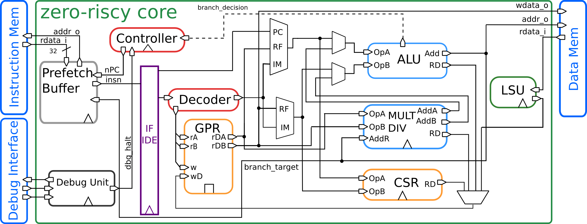

# 已适配的 SoC 的介绍  
  
## YADAN Core 内核的 YADAN SoC  
### YADAN 项目的简介  
YADAN 项目包含 YADAN Core、YADAN SoC、YADAN Board，分别是 RISC-V 指令集的 CPU 内核、SoC、开发板。  
YADAN SoC 是 VeriMake 设计的一款 SoC，它搭载一颗 RISC-V 指令集的 YADAN Core，开发者可灵活配置自定义的外设。  
  
// TODO: 文档将在近期发布  
  
## Zero-riscy 内核的 PULPino SoC  
### PULPino 与 Zero-riscy 的简介  
  
[The Parallel Ultra Low Power (PULP) Platform](https://pulp-platform.org/) 是由 ETH Zürich (瑞士苏黎世联邦理工学院) 的 Integrated Systems Laboratory (IIS) 和 University of Bologna (意大利博洛尼亚大学) 的 Energy-efficient Embedded Systems (EEES) 在 2013 年开始共同创造的一个定制化 SoC 设计平台，旨在探索用于超低功耗处理的新型高效架构。[PULPino](https://github.com/pulp-platform/pulpino/) 是 PULP Platform 中的一款开源单核 MCU 开发平台，可配置内核为两款 32 位 RISC-V CPU 之一，分别是 RI5CY 和 Zero-riscy。  
  
我们选用 Zero-riscy 内核构建 PULPino SoC 进行后续的实验，[Zero-riscy](https://github.com/lowRISC/ibex/) 是一款二级流水线、按序单发射的处理器，支持标准的 RV32I 指令子集，同时可以配置压缩指令子集（RV32C）、乘除法指令子集（RV32M），还可以被配置成16个通用寄存器版本的 RV32E。Zero-riscy 没有 iCache 和 dCache，核心使用非常简单的数据和指令接口来与数据和指令存储器通信。该内核主要适用于超低功耗、超小面积的场景，结构如图 2.2.1 所示。  
  
**
  
图 2.2.1 Zero-riscy 内核结构
**
  
  
### 本实验采用的 SoC 的概况  
  
我们实验即将使用的 Zero-riscy 内核的 PULPino SoC 结构如图 2.2.2 所示，内核通过 AXI4 总线与外设相连，默认包含有 GPIO、UART、I²C 等外设。在实际的实验中，我们对原始的 PULPino SoC 进行了裁剪，省去了 Debug Unit、SPI Slave 和 FLL Control 模块。  
  
**
  
图 2.2.2 本实验采用的 Zero-riscy 内核的 PULPino SoC 的结构图
**
  
我们用于实验的 SoC 默认拥有如下的资源：  
  
&nbsp;&nbsp;(1) Instruction RAM 64KB  
&nbsp;&nbsp;(2) Boot ROM 32KB  
&nbsp;&nbsp;(3) Data RAM 32KB  
&nbsp;&nbsp;(4) GPIO 16个  
&nbsp;&nbsp;&nbsp;&nbsp;其中 0 ~ 13 号引脚与 Arduino UNO 的布局兼容，14 号引脚连接标号为 DONE 的 LED，15 号引脚连接标号为 K_50 的按键  
&nbsp;&nbsp;(5) 定时器 2个  
&nbsp;&nbsp;(6) UART 1个  
&nbsp;&nbsp;(7) I²C 1个  
&nbsp;&nbsp;(8) SPI Master 4个  
&nbsp;&nbsp;&nbsp;&nbsp;默认实例化其中 1 个，连接用户 SPI Flash（其中地址 0x0000 ~ 0xFFFF 用于存放用户程序，地址 0x10000 存放目前在低 64KB 空间中存放的程序大小，其余空间可供用户使用），另外 3 个可供用户自定义使用  
&nbsp;&nbsp;(9) 支持中断控制器控制系统总中断  
  
  
### 本实验采用的 SoC 的内存地址分配  
  
**
  
图 2.2.3 本实验采用的 SoC 的内存地址分配
**
  
地址为 0x0000_0000 ~ 0x0000_FFFF 的存储空间是用户编写的程序存放的空间，称为指令存储器 (Instruction Memory)，大小为 64KB。这部分空间在 FPGA 中是使用 RAM 来构成的，掉电后数据会丢失，所以我们的程序可以存放在 FPGA 外部的用户 Flash 中，Flash 掉电非易失。但是，CPU 核的指令接口是连接这 FPGA 中的 RAM 的，所以 SoC 通常都会拥有一块掉电非易失的存储器来存放内核启动时候开始做的一些工作，比如将片外 Flash 的程序加载到内部的指令存储器中，这些工作被称为 Bootloader。我们的 Bootloader 程序存放在地址为 0x0001_0000 ~ 0x0001_07FF 的 Boot ROM 中，大小为 32KB。Bootloader 主要执行的工作为：如果在 CPU 启动时串口有下载程序的请求，就将串口发送来的程序同时存放到指令存储器和 Flash 对应的位置上，完成后复位程序计数器到指令存储器启动地址再开始执行程序；如果在 CPU 启动时没有收到下载程序的请求，就会将存放在 Flash 中的程序加载到指令存储器中，再复位程序计数器到指令存储器启动地址再开始执行程序。地址为 0x0010_0000 ~ 0x0010_07FF 的存储空间为数据存储器 (Data Memory)，大小为32KB。  
  
地址为 0x1A10_0000 ~ 0x1A11_1000 的存储空间被分配给外设，每 4KB 地址对应一个外设，即每个外设可拥有 4KB 的存储空间，主要用来存放各个外设所需要的寄存器。理论上算，每个外设最多可以拥有 32 位的寄存器 1024 个，当然在实际使用中极少有情况需要这么多，所以这样分配地址在绝大多数情况是足够的。  
  
### 中断向量表  
  
Zero-riscy 支持 9 个外部中断，3 个异常，在每个中断和异常发生时，内核会跳转到相应的程序地址里开始执行中断 / 异常处理程序。表 2.1 列出了各个中断 / 异常的入口地址，即中断向量表 (Interrupt Vector Table, IVT)。  
  
**
表 2.2.1 中断 / 异常 向量表**  
| 描述                         | 地址                      |
| ---------------------------- | ------------------------- |
| 保留-未使用                  | 0x0000_0000 ~ 0x0000_0058 |
| 中断 23 ：I²C IRQ            | 0x0000_005c               |
| 中断 24 ：UART IRQ           | 0x0000_0060               |
| 中断 25 ：GPIO IRQ           | 0x0000_0064               |
| 中断 26 ：SPI Master 0       | 0x0000_0068               |
| 中断 27 ：SPI Master 1       | 0x0000_006C               |
| 中断 28 ：Timer A Overflow   | 0x0000_0070               |
| 中断 29 ：Timer A Output Cmp | 0x0000_0074               |
| 中断 30 ：Timer B Overflow   | 0x0000_0078               |
| 中断 31 ：Timer B Output Cmp | 0x0000_007C               |
| RESET                        | 0x0000_0080               |
| 非法指令异常                 | 0x0000_0084               |
| ECALL 指令                   | 0x0000_0088               |

  
IVT 中的每个条目都是一个地址，该地址对应的存储空间存储的内容要么是一个 32 位的指令，要么是一个或两个 16 位的指令。在大多数情况下，这个指令是一个跳转指令，执行后程序计数器将跳转到另一个地址，然后执行真正的中断处理程序。  
  
### 外设相关的寄存器介绍  
从前文的图 2.2.2 中可以看到，在这个 SoC 中，外设通过 APB 总线与 CPU 核相连，外设的地址范围是 0x1A10_0000 ~ 0x1A11_1000，每个外设被分配了 4KB 的地址空间以供内核进行访问。在后文，本文将分别对每个外设进行介绍。  
  
### UART 串口  
该系统中使用的 UART 与 16750（串口设计的一个标准）兼容。它具有所有典型的 UART 信号、以及 16750 定义的一些附加信号，详见表 2.2.2。  
  
**
表 2.2.2 UART 串口端口描述**  
| Signal   | Direction | Description         |
| -------- | --------- | ------------------- |
| uart_tx  | output    | Transmit Data       |
| uart_rx  | input     | Receive Data        |
| uart_rts | output    | Request to Send     |
| uart_cts | input     | Clear to send       |
| uart_dtr | output    | Data Terminal Ready |
| uart_dsr | input     | Data Set Ready      |

// TODO:  
  