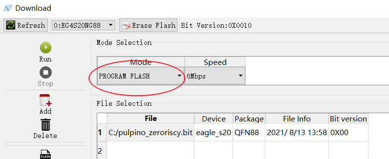
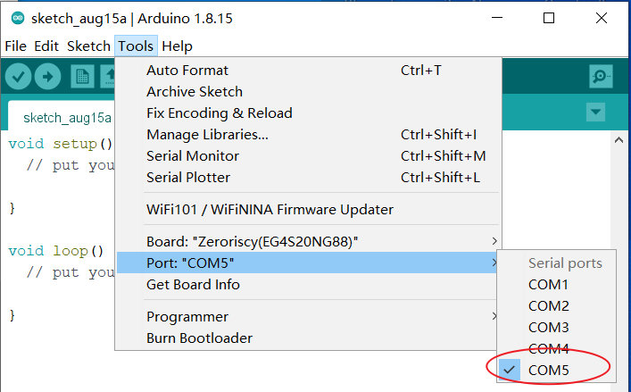
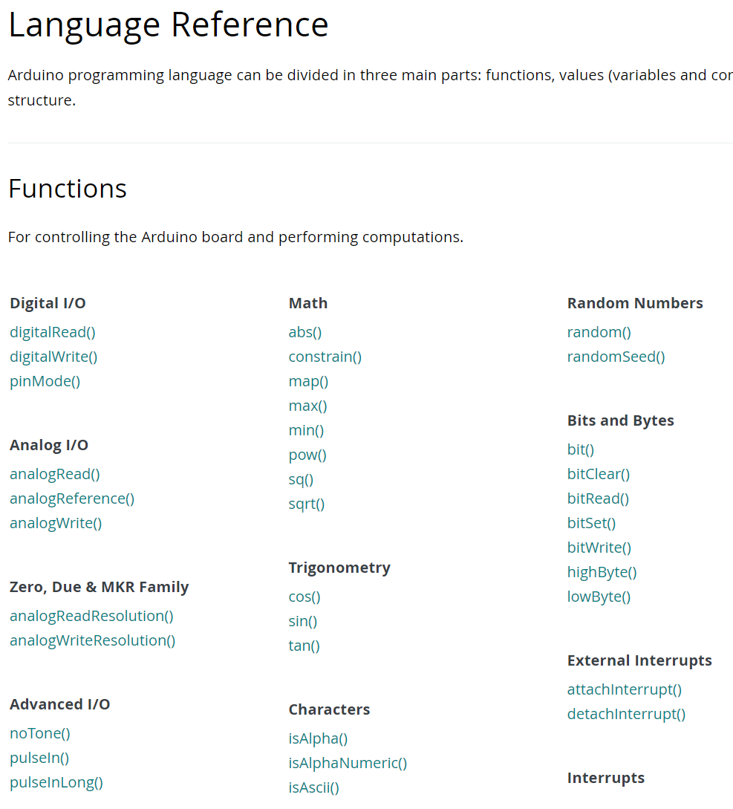
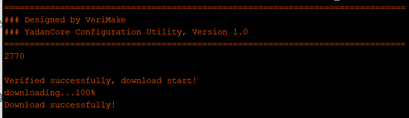
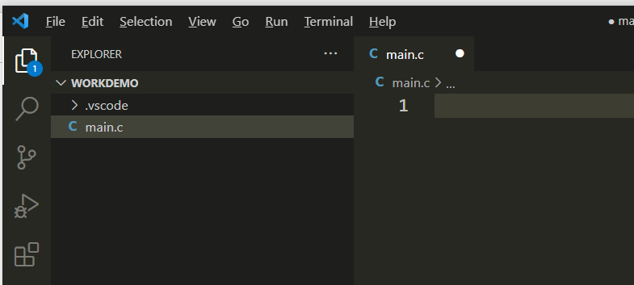
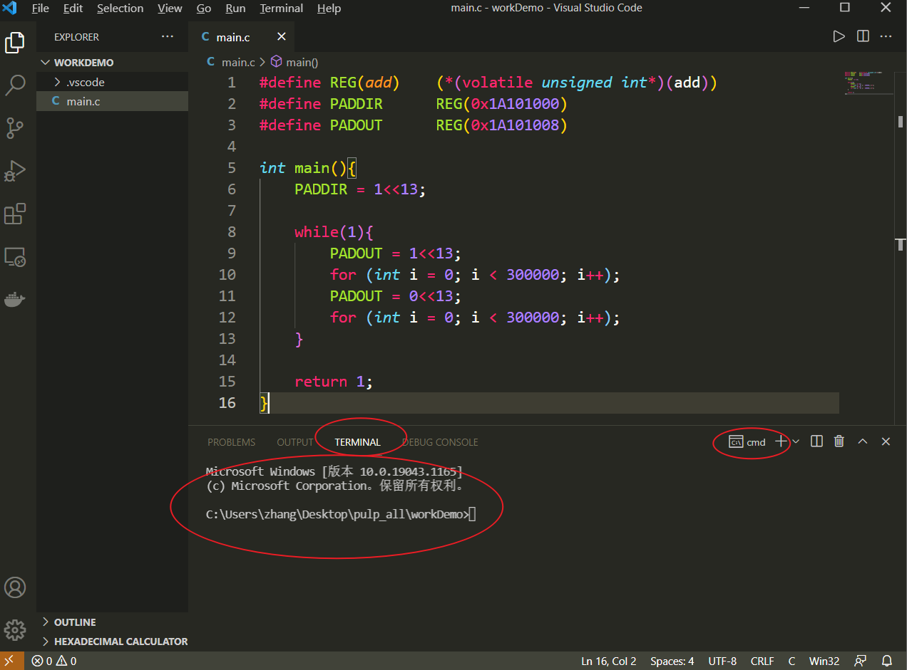
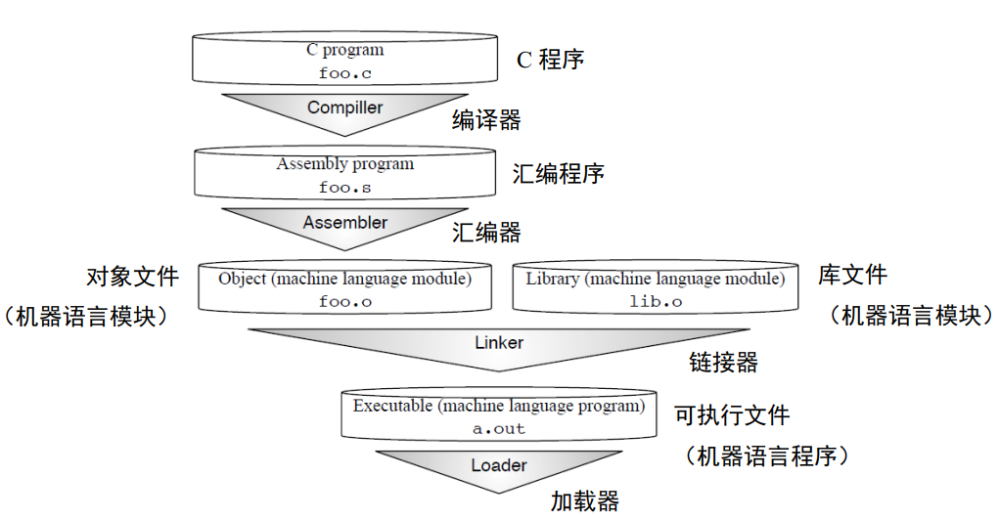
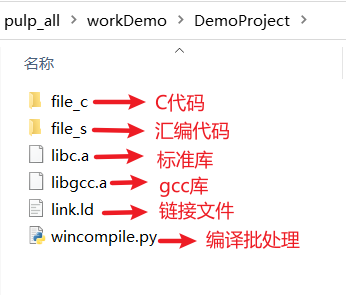
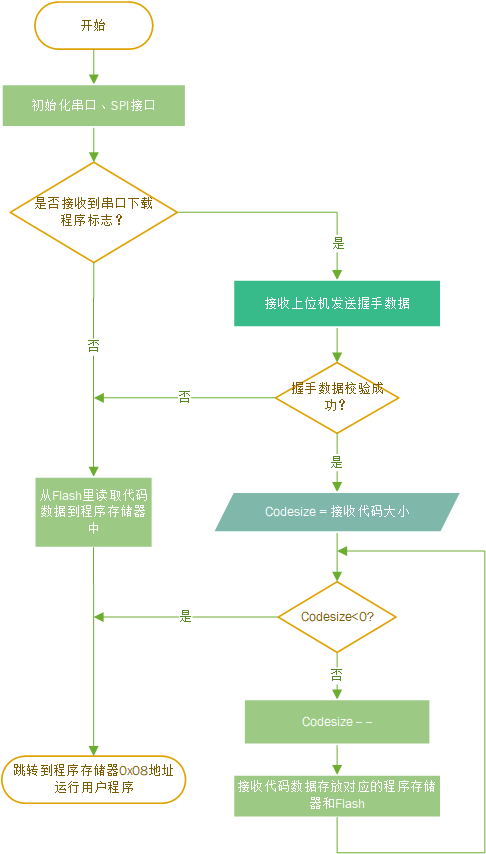

# 使用 YADAN Board  
  
本章将介绍如何把 YADAN SoC 或 PULPino SoC 部署到我们的 YADAN Board 中，使其变成一块类似 Arduino UNO 的嵌入式开发板。部署完成后，配合第三章中在 Arduino IDE 中配置好的环境，我们即可像使用 Arduino 一样便捷地在 YADAN Board 上开发嵌入式软件。  
  
## 部署 SoC 至 FPGA  

综合好的 YADAN SoC 的 `.bit` 文件为 `Yadan.bit`，PULPino SoC 的为 `pulpino_zeroriscy.bit`，分别可在下边两个链接中找到。  
  
+ YADAN SoC: [https://gitee.com/verimake/yadansoc/tree/master/prj](https://gitee.com/verimake/yadansoc/tree/master/prj)
+ PULPino SoC: [https://pan.baidu.com/s/1uzZ-Ic4XPclwRXgk5f-Z_g](https://pan.baidu.com/s/1uzZ-Ic4XPclwRXgk5f-Z_g) (提取码: 3005, 在 “Zeroriscy内核开发工具” 文件夹中)
  
打开安装好的 TD 软件，点击如图 4.1 所示的按钮打开下载工具。
  
**<center>  
图 4.1 TD 软件中打开下载工具的按钮</center>** 
  
打开的下载工具的界面如图 4.2。  
**<center>  
图 4.2 下载工具的界面</center>** 
  
将 YADAN Board 通过 Type-C USB 线与 PC 机相连，下载工具中原先显示 `No hardware` 的下拉框就会自动更新为 `EG4S20NG88`（如果加载不了需要检查下载器驱动是否正确安装，详情见[第 3.3 节](chap3.html#id3)）。加载成功开发板后，界面如图 4.3 所示。  
  
**<center>  
图 4.3 下载工具加载成功开发板后的界面</center>** 
  
然后点击如图 4 所示的 `Add` 按钮，添加你想部署的 SoC 的 `.bit` 文件。
  
**<center>  
图 4.4 下载工具中的 `Add` 按钮</center>**
  
添加 `.bit` 文件完成后，可以看到文件的相关信息，包含该文件适用的芯片型号、封装、生成时间等，如图 4.5 为例。  
  
**<center>  
图 4.5 显示的 `Yadan.bit` 的文件信息（如果用 PULPino，也能看到类似的内容）</center>**

`Mode Selection` 中可以选择下载模式，默认的下载模式为 `JTAG` 模式，适用于调试，但配置会在掉电后丢失。如果我们希望下次上电后 FPGA 能自动加载配置，则需要把配置下载到 FPGA 的配置芯片外置的 Flash 中，即我们需要选择下载模式为 `PROGRAM FLASH` 模式。下载速度默认为 1Mbps，我们可根据电脑和线材条件自由选择，但如果下载失败，需尝试降低下载速度再重新下载。选择下载模式的下拉框如图 4.6 所示。

**<center>  
图 4.6 选择下载模式的下拉框</center>**
  
在该模式下载完成后，开发板每次上电时，会先将 Flash 中存储的配置数据自动加载到 FPGA 中。  
  
## 使用 Arduino IDE 开发应用程序  
  
在[第 3.4 节](chap3.html#arduino-ide-yadan-board)，我们介绍了如何安装与配置 Arduino IDE 和 YADAN Board 开发板工具包。本节将介绍如何使用 Arduino IDE 给开发板开发嵌入式软件。
  
首先，使用 Micro-USB 线将部署好 SoC 的开发板连接至电脑，电脑会读取到一个 UART 串口，我们可在设备管理器中看到名为 `USB-SERIAL CH340` 的这个串口，括号内即为该串口的 COM 号，如图 4.7 为例。如果没有看到串口号或显示未知设备，需要在百度网盘中或[沁恒官网的对应页面](http://www.wch.cn/products/CH340.html)下载 CH340 的驱动程序并安装。  
  
**<center>  
图 4.7 在设备管理器中查询串口的 COM 号（不同电脑会分配不同的编号）</center>**

打开 Arduino IDE，根据之前部署的 SoC，在 `Tools -> Board` 中选择 `YADAN Board (VeriMake)` 中的 `YADAN` 或 `Zero-risky`。然后根据刚才查询到的 COM 号，然后选择 Port 为刚刚查询的串口号，如图 4.8 所示。  

**<center>  
图 4.8 选择开发板的串口号（不同电脑会分配不同的编号）</center>**
  
接下来就可以使用 Arduino 语言来开发嵌入式软件了，Arduino 语言的语法请参考 Arduino 官网的 [Language Reference](https://www.arduino.cc/reference/en/)。不过要注意的是，YADAN SoC 或者 PULPino SoC 暂时还不支持所有的 Arduino 函数，例如 Analog I/O 里的 `analogRead()` `analogReference()` 等与模数转换器 (Analog-to-Digital Converter, ADC) 相关的内容暂时还不可用（因为目前本文档中所述的 YADAN SoC 或者 PULPino SoC 还没有实例化 ADC 端口，需修改 SoC 添加外设来支持，但这部分不在嵌入式软件的教学内）。此外还需注意的是，原版 Arduino 是以 AVR 单片机为平台来开发的，但是我们使用的是 RISC-V 指令集的 SoC，所以不一定百分百兼容所有的 Arduino 函数。  
  
**<center>  
图 4.9 Arduino 官网的 Language Reference</center>**
  
我们可以参考 Arduino 的[基础示例](https://www.arduino.cc/en/Tutorial/BuiltInExamples)，编写一个让 LED 闪烁的简单程序来了解开发的整个流程。首先先填入下列代码（这份代码也可以在 Arduino IDE 的 `File -> Examples -> 01.Basics -> Blink` 中找到）
```
/*
  Blink
  Turns an LED on for one second, then off for one second, repeatedly.
  This example code is in the public domain: http://www.arduino.cc/en/Tutorial/Blink
*/

// the setup function runs once when you press reset or power the board
void setup() 
{
    // initialize digital pin LED_BUILTIN as an output.
    pinMode(LED_BUILTIN, OUTPUT);
}

// the loop function runs over and over again forever
void loop() 
{
    digitalWrite(LED_BUILTIN, HIGH);   // turn the LED on (HIGH is the voltage level)
    delay(1000);                       // wait for a second
    digitalWrite(LED_BUILTIN, LOW);    // turn the LED off by making the voltage LOW
    delay(1000);                       // wait for a second
}
```
  
代码中的 `LED_BUILTIN` 对应开发板上 GPIO 的第 13 号引脚，该引脚在电路中连接了一个 LED（原理图可参考[第 1.2.2 节](chap1.html#led)），这份代码将实现让这个 LED 亮一秒、灭一秒的无限循环。我们点击如图 4.10 指出的 `Upload` 按钮，IDE 即会自动开始编译程序、并下载至开发板。  
  
**<center>  
图 4.10 Arduino IDE 中的 `Upload` 按钮</center>**
  
若编译与下载成功完成，我们可在提示行内看到类似图 4.11 所示的下载成功的提示。  
  
**<center>  
图 4.11 下载成功的提示</center>**
  
下载成功后，即可观察到开发板上的 LED 开始亮一秒、灭一秒的无限循环了，而且断电重新上电后程序依然还能执行。就与这几行简短的代码类似，我们只需要知道相关外设的操作函数就可以快速实现更多所需的功能，而无需特别关注这些函数的底层操作，可以体验到，Arduino 语言提高了嵌入式软件开发的便捷程度。这是因为，Arduino 语言将操作各个外设的底层代码封装成了一个个函数，组成了函数库。  
  
现在的芯片规模越来越大，功能越来越丰富，很多芯片厂商除了提供数据手册外也会提供一套函数库给开发者，因为库能够让开发变得更好、更快、更高效。不过，对于需要走向专业的学习者而言，只学习应用层面的开发是不够的，开发函数库也是需要学习的重要技能。那么，对于我们的 YADAN SoC 或 PULPino SoC，要如何从零开始写第一行代码呢，下一节将介绍如何使用 RISC-V GCC 工具链来更为底层地开发我们的程序。  
  
## 使用 RISC-V GCC 工具链从底层开发程序  
  
前边的[第 3.5 节](chap3.html#risc-v-gcc)介绍了 RISC-V GCC 工具链的安装方法，接下来我们将以控制 LED 闪烁为例来介绍使用 RISC-V GCC 工具链从底层开发程序的流程。  
  
### 安装并配置代码编辑器 (以 VS Code 为例)  
  
首先，我们需要编写我们的代码。由于 RISC-V GCC 工具链只提供了编译工具链，而没有提供集成开发环境 (IDE)，也就是不包含代码编辑器，所以我们需要使用其它编辑器来编辑代码。Windows 系统自带的记事本就是一个最简单的可以编写代码的编辑器，但是它功能原始，没有提供自动高亮显示、自动缩进、代码提示等功能。为了更加高效地编写高质量的代码，我们可以选用一款更现代化的代码编辑器，常用的代码编辑器有 VS Code (Visual Studio Code)、Atom、NotePad++、Vim、Sublime 等。本文使用 VS Code 为例来讲解。  
  
安装好 VS Code 后，创建一个路径中不包含中文或特殊字符的文件夹，将其视为项目文件夹。打开VS Code，点击 `File -> Open Folder` 打开这个文件夹作为工作目录，然后新建一个后缀为 `.c` 的文件 `main.c`，如图 4.12。
  
**<center>  
图 4.12 VS Code 的界面</center>**
  
我们可以在 VS Code 上安装扩展插件，来获得 C/C++ 语言的自动高亮显示、自动缩进、代码提示等功能，只需点击 VS Code 左侧的 `Extends`，然后在里边搜索一个叫做 `C/C++` 的扩展插件，根据提示安装即可。如果需要增加其它扩展插件，也可以自行上网查找。

### 编写代码  

**注：本节中，有关寄存器地址的代码仅供参考，需根据实际选用的 SoC 来填写，寄存器地址可在[第 2 节](chap2.html)中查询。**
  
[第 2.1.5.2 节](chap2.html#gpio)介绍了 YADAN SoC（PULPino 为[第 2.2.5.2 节](chap2.html#id20)）中与 GPIO 相关的寄存器，一共有 8 个，每个寄存器都可通过一个地址来访问。我们若需要通过控制第 13 号 GPIO 引脚输出电平的高低来控制 LED 的亮灭，则需要对两个与 GPIO 相关的寄存器进行操作，分别是 `PADDIR` 和 `PADOUT`，两个寄存器的地址可在第 2 节的对应位置处查询。通过对这两个寄存器进行写入，就可以控制对应的 GPIO 引脚的输入输出模式与输出电平高低。  
  
为了让灯以便于肉眼观察的频率闪烁，我们需要在亮灭切换之间增加延时，延时可以通过软件循环来实现，也可以通过定时器来实现。通过软件循环实现延时的代码比较简单，但无法保证时间精准，适合对时间精准程度要求不高的场景，如果要求时间精准，需使用定时器延时。因编写软件循环实现延时的代码较为容易，所以本节中让灯闪烁的示例代码将使用软件循环来进行延时。  
  
要实现让灯闪烁，我们的代码可以执行以下操作：
1. 设置 GPIO 的 13 号引脚为输出模式
2. 设置 GPIO 的 13 号引脚输出高电平（或低电平）
3. 延时一段时间
4. 设置 GPIO 的 13 号引脚输出低电平（或高电平）
5. 延时一段时间
6. 回到第 2 步
  
这些步骤中对 GPIO 引脚进行的操作都是通过对 GPIO 相关的寄存器进行写入来实现的，每个寄存器都被分配有一个地址，对这些特定的地址进行读写就可以对对应的寄存器进行读写，所以我们可以编写如下代码：
  
```
#define REG(add) (*(volatile unsigned int *)(add))  // 宏定义能让后边的代码更简短
#define PADDIR REG(0x4A101000)
#define PADOUT REG(0x4A101008)

int main()
{
    PADDIR = 1 << 13; // 设置 GPIO 的第 13 号引脚为输出模式

    while (1)         // 无限循环
    {
        PADOUT = 1 << 13;                // 设置 GPIO 的第 13 号输出高电平
        for (int i = 0; i < 300000; i++) // 软件延时
            ;
        PADOUT = 0 << 13;                // 设置 GPIO 的第 13 号输出低电平
        for (int i = 0; i < 300000; i++) // 软件延时
            ;
    }

    return 1;
}
```
  
编写完成后，点击 `File -> Save` 或者按键盘快捷键 `Ctrl + S` 保存文件。  
  
### 编译与观察编译过程  
  
在初学 C/C++ 时，我们可能会被告知程序会从 `main()` 函数开始运行，但是实际上真的是这样的吗？我们接下来来看看如何编译这个 `main.c` 文件，再看看编译后得到的是什么。  
  
在 VS Code 中，点击 `Terminal -> New Terminal` 开启一个终端，如图 4.13 所示。  
  
**<center>  
图 4.13 在 VS Code 内打开终端</center>**
  
在终端中，光标左侧显示的是终端当前所在的工作目录，我们能在光标处输入命令来调用 RISC-V GCC 工具链去编译代码，输入  
```
riscv-none-embed-gcc -march=rv32imc -mabi=ilp32 --specs=nosys.specs -o main.elf main.c
```
即可开始编译刚刚编写的 `main.c`。  
  
上边的命令中，参数 `-march=rv32imc` 中的 `rv32` 为指定编译器将面向 32 位的 rv32 内核编译程序，`imc` 表示内核支持整形指令(i)、乘除指令(m)和压缩指令(c)；参数 `-mabi=ilp32` 是设置浮点参数传递规则，由于 YADAN Core 和 Zero-riscy 均不支持浮点扩展指令，所以设置为不需要浮点扩展指令的 `ilp32`；参数 `--specs=nosys.specs` 表示使用精简的 C 库替代标准的 C 库；参数 `-o` 用来指定输出的文件的名字和格式，这里命名为了 `main.elf`，即编译成功后就会在同目录下输出 `.elf` 后缀的 `main.elf` 文件。最后的 `main.c` 是指定代码原文件。  

生成的 `.elf` 文件是个机器码文件，但还不能直接给核运行。那么，这个文件里有什么呢？我们可以使用 `objdump` 命令将它反汇编成 `.s` 文件
```
riscv-none-embed-objdump -D main.elf > main.s
```

我们打开这个 `main.s` 文件就可以看到汇编代码，如图 4.14。
  
**<center>  
图 4.14 `main.s` 里的汇编代码</center>**
  
可以发现，里边不仅有我们的 `main` 函数，还有很多不是我们自己编写的函数，例如 `_start`、`__libc_init_array`、`_exit` 等。其实，这些都是我们在编译 `main.c` 时，编译器另外从 `crt0.o` 文件中加载的。`crt0.o` 是一个启动代码，包含了初始化等工作，例如初始化寄存器、初始化地址空间、初始化中断向量表等。那么真正的编译过程以及所有的代码原型是怎么样的呢？  
  
整个编译（广义）过程包含以下几个过程，在后面的实验中，我们将分步执行这几个过程，了解其中的完整的流程:  
1. `gcc -E` 预处理 (preprocess)，输出预处理后的源码(`.i` 文件)  
2. `gcc -S` 编译 (compile)，输出汇编代码文件(`.s` 文件)  
3. `gcc -c` 汇编 (assemble)，输出机器码文件(`.o` 文件)  
4. `gcc -T` 链接 (link)，输出链接文件(`.elf` 文件)  
  
这个流程也可以参考图 4.15。
  
**<center>  
图 4.15 C 代码到可执行文件的完整编译流程**  
*(image source: **[COMPILER, ASSEMBLER, LINKER AND LOADER:
A BRIEF STORY](https://www.tenouk.com/ModuleW.html)**)*</center>  
  
为了能够更好地掌握我们的代码以及生成的机器码，我们可以自己编写启动代码和链接器。这里的启动代码就是我们的代码头，即进入 `main()` 函数之前机器要做的事，一般由汇编语言编写。链接脚本 (link script) 是后缀为 `.ld` 的文件，该文件描述了链接器输入文件与输出文件之间的映射，链接器读取后可根据其描述将机器码文件与依赖的其它机器码文件进行链接，以生成最终的可执行机器码文件。  
  
我们提供了启动代码和链接脚本的样本：`crt0_riscv.s` 和 `link.ld`，复制到工程目录下即可使用，其中的启动代码是一种简化版。  

在使用 RISC-V GCC 编译(广义)程序的整个流程中，预处理、编译(狭义)、汇编、链接四个阶段的指令分别如下：
```
riscv-none-embed-gcc -march=rv32imc -mabi=ilp32 -E -o main.i main.c              # 1 - 预处理
riscv-none-embed-gcc -march=rv32imc -mabi=ilp32 -S -o main.s main.i              # 2 - 编译
riscv-none-embed-gcc -march=rv32imc -mabi=ilp32 -c -o main.o main.s              # 3.1 - 汇编 main.s 文件
riscv-none-embed-gcc -march=rv32imc -mabi=ilp32 -c -o crt0_riscv.o crt0_riscv.s  # 3.2 - 汇编 crt0_riscv.s 文件
riscv-none-embed-ld -T link.ld main.o crt0_riscv.o -o main.elf                   # 4 - 链接
```
  
得到 `.elf` 文件后，使用 `objdump` 命令我们也可以反汇编它，来观察它对应的汇编代码。  
```
riscv-none-embed-objdump -D main.elf > code.s
```
  
运行成功后，可以打开 `code.s` 文件来观察。我们可以发现，启动文件 `crt0_riscv.s` 被放在了这份汇编代码的开头，直到后边的一行 `jal ra,10c <main>` 才真正跳转到 `main()` 函数开始执行。
  
**<center>  
图 4.16 `main()` 函数真正的入口</center>**
  
不过，`.elf` 文件还不能直接让 CPU 直接执行，我们可将其转换为 `.hex` 或者 `.bin` 文件，转换的指令如下：
```
riscv-none-embed-objcopy -O ihex main.elf main.hex    # 转成 HEX
riscv-none-embed-objcopy -O binary main.elf main.bin  # 转成 BIN
```
  
得到 `.hex` 或者 `.bin` 文件后，继续参考第 4.3.4 节的说明，将文件下载进指令存储器，就可以让 CPU 执行了。  
  
### 使用 Python 脚本自动编译  
  
在前一节中，我们发现，想将代码编译并转换成最终的 `.hex` 或者 `.bin` 文件，是需要输入好几步很长的指令的。假如我们在真正开发程序，每次修改代码后都需要编译，反复输入这些很长的指令是比较低效的。  
  
我们可以使用其它工具来自动化这样的繁杂流程，一种方式是使用 GNU Make，不过需要学习 Makefile 的编写规则。然而，因为我们只需要执行几条命令行命令，不必用到 GNU Make 中的更多高级功能，所以可以使用另一种更简单的方式，即使用 Python 编写一个简单的脚本来完成整个流程。  
（如果没有安装 Python，也可以在百度网盘中找到安装程序）  
  
在百度网盘下载的文件中，我们可以找到有如图 4.17 所示的样例工程的文件夹，后续开发各种工程可以把它作为目录模板。  

**<center>  
图 4.17 样例工程的文件夹</center>**
  
`file_c` 和 `file_s` 分别用于存放 C 代码和汇编代码，启动文件已位于 `file_s` 中，是目前 SoC 适用的一个完整版，后期我们编写的自己的 C 代码只需放入 `file_c` 目录即可。`libc.a ` 和 `libgcc.a` 是库文件，`link.ld` 是链接脚本，它将程序首地址定位在 0x00000000，RAM 定位在 0x00100000。Python 脚本 `wincompile.py` 用来处理 `file_c` 和 `file_s` 文件夹里的源码，它会将这些源码编译并生成最终的 `.bin` 文件，我们在命令行中输入  
```
python wincompile.py
```
  
即可运行它自动完成编译，生成的 `.bin` 文件会被命名为 `simple.bin`。  
  
### 设计 Bootloader，下载程序至开发板  
  
得到了 RISC-V 处理器可执行的文件之后，由于我们之前已经将 SoC 部署到了 FPGA 中，接下来只需将文件载入 SoC 中的指令存储器（从 0x00000000 地址开始，有 64KB 大小）即可执行，将文件载入指令存储器通常有以下三种方法：
1. 将 `.hex` 或者 `.bin` 文件转换成 `.mif` (Memory Initialization File) 文件，然后在 FPGA 综合工具中导入它再重新综合 SoC。这个方法非常繁琐且耗时。  
2. 使用调试器将 `.hex` 或者 `.bin` 文件载入到指令存储器中。这个方法要求 SoC 必须要有调试接口，例如 J-Link 等，但我们的 SoC 没有。  
3. 配置一段程序，存放在 Boot ROM 中。SoC 启动后会先执行 Boot ROM 中的程序，再通过这段程序将数据从外部载入到指令存储器中，即 Bootloader。  
  
其中，Bootloader 方法对 YADAN Board 而言是较为合适的方法。我们已预先设计好工作流程图如图 4.18 所示的 Bootloader 程序，并在综合 SoC 时已通过 `.mif` 文件将其导入，每次 FPGA 上电后初始化 SoC 时，都会向 Boot ROM 中初始化这个 Bootloader。  
  
**<center>  
图 4.18 我们的 Bootloader 的工作流程图夹</center>**
  
// TODO: 后续内容正在优化中，敬请期待
  

### 相关文件介绍
  
// TODO: 后续内容正在优化中，敬请期待
  