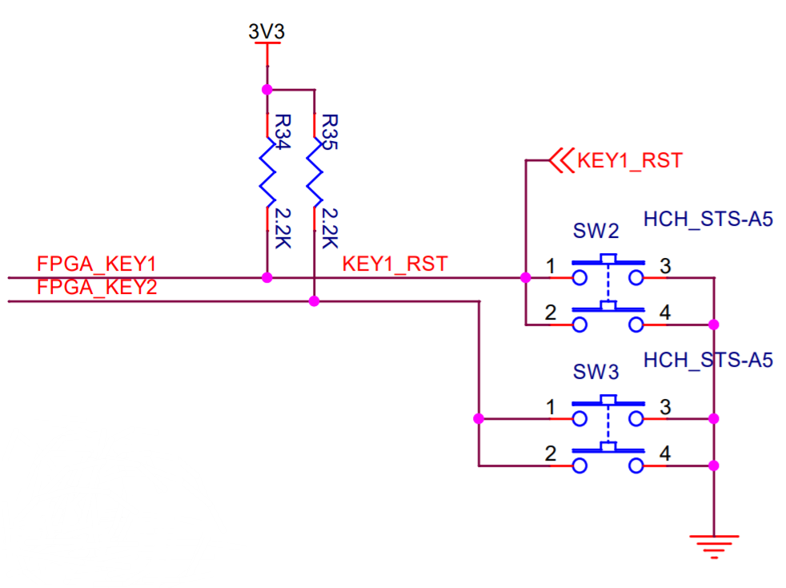
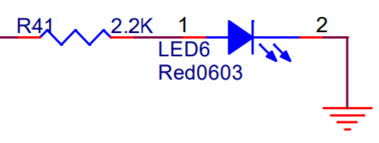
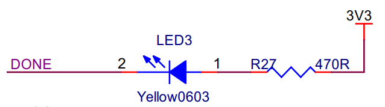
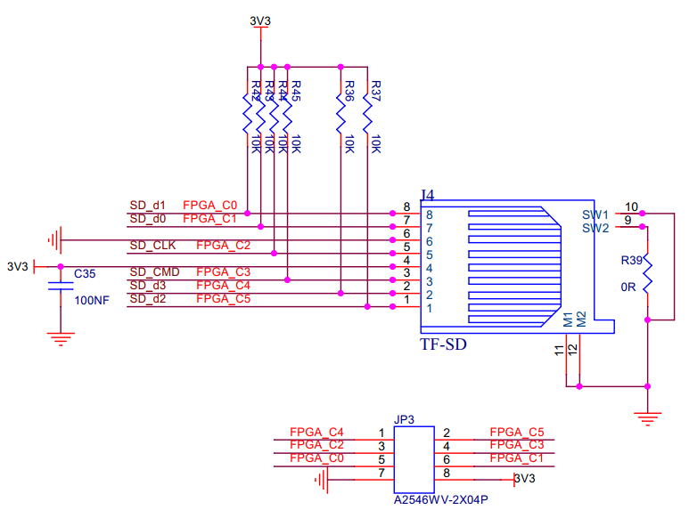
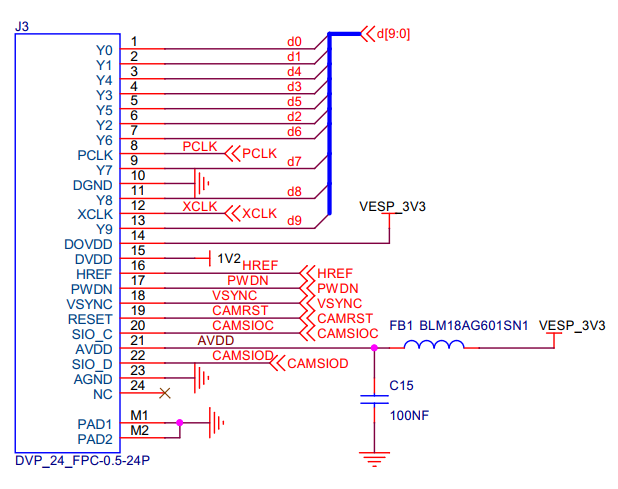

# YADAN Board 开发板介绍  
  
YADAN Board 是一块核心为 Anlogic FPGA 的可编程硬件设计学习平台，原理图可点击该链接浏览或者下载：[Schematic_YADAN_v1_0_1_20211228_B.pdf](https://github.com/CSY-tvgo/YADAN-Docs/blob/main/docs/source/attachments/Schematic_YADAN_v1_0_1_20211228_B.pdf)  
（如果 GitHub 加载较慢也可以点 [这个链接](https://gitee.com/verimaker/yadan-board/blob/master/Schematic_YADAN_v1_0_1_20211228_B.pdf) 在 Gitee 上下载）  
  
当我们需要学习嵌入式入门知识时，我们可以移植一颗 SoC （可选 YADAN Core 内核的 YADAN SoC 或 Zero-riscy 内核的 PULPino SoC）到 FPGA，在其基础上学习嵌入式软件开发。YADAN Board 兼容 Arduino UNO 接口，我们能像使用 Arduino 一样轻松上手。  
  
当我们需要深入学习数字系统设计时，也能够在 YADAN Board 的 FPGA 上容易地搭建数字系统。从译码器等简单的数字逻辑电路、到 CPU 内核、到接入总线的外设、到 SoC，在实践中一步一步学习数字系统设计和芯片架构。  
  
使用 YADAN Board 进行学习或开发需要使用 Arduino IDE、TangDynasty 等开发工具，通常，这些工具能在 Windows 7 及更高版本的电脑上运行。  
  
  
## 开发板主要资源  

YADAN Board 主要拥有以下资源：  
&nbsp;&nbsp;(1) 主控采用Anlogic高性能FPGA芯片EG4S20NG88  
&nbsp;&nbsp;&nbsp;&nbsp; ♢ 等效 23520 个四输入查找表  
&nbsp;&nbsp;&nbsp;&nbsp; ♢ 最大 156.8K 分布式 RAM  
&nbsp;&nbsp;&nbsp;&nbsp; ♢ 64 块 9Kb 嵌入式 RAM 和 16 块 32Kb 嵌入式 RAM  
&nbsp;&nbsp;&nbsp;&nbsp; ♢ 64Mbit SDRAM，最高 200MHz 工作频率  
&nbsp;&nbsp;&nbsp;&nbsp; ♢ 16 个全局时钟，3 个 PLL  
&nbsp;&nbsp;&nbsp;&nbsp; ♢ 1MSPS 12-bit SAR 型 ADC  
&nbsp;&nbsp;(2) 板载2片SPI Flash  
&nbsp;&nbsp;&nbsp;&nbsp; ♢ 一片 FPGA 配置 Flash， 六线连接 FPGA  
&nbsp;&nbsp;&nbsp;&nbsp; ♢ 一片用户 Flash， 六线连接 FPGA  
&nbsp;&nbsp;(3) 板载六线TF卡接口  
&nbsp;&nbsp;(4) 板载1个USB转串口  
&nbsp;&nbsp;(5) USB-C供电及程序下载  
&nbsp;&nbsp;(6) 板载2个独立微动按键输入  
&nbsp;&nbsp;(7) 板载1个LED灯输出  
&nbsp;&nbsp;(8) 拓展接口  
&nbsp;&nbsp;&nbsp;&nbsp; ♢ 兼容 Arduino接口  
&nbsp;&nbsp;&nbsp;&nbsp; ♢ 0.5mmFPC-24P 标准 DVP Camera 接口  
  
YADAN Board 的硬件布局如图 1.1 所示，硬件接口介绍见表 1.1。  
  
**
  
图 1.1 YADAN Board 的硬件布局
**
  
  
**
表 1.1 YADAN Board 的硬件接口介绍**  
| 硬件功能分组            | 接口名           | 引脚号        |
| ----------------------- | ---------------- | ------------- |
| CLK                     | CLK_24MHz        | P34           |
| 用户 SPI Flash          | FLASH_CS         | P71           |
| 用户 SPI Flash          | FLASH_MISO       | P72           |
| 用户 SPI Flash          | FLASH_WP         | P74           |
| 用户 SPI Flash          | FLASH_HOLD       | P75           |
| 用户 SPI Flash          | FLASH_CCLK       | P76           |
| 用户 SPI Flash          | FLASH_MOSI       | P77           |
| TF 卡接口               | SD_D0            | P62           |
| TF 卡接口               | SD_D1            | P61           |
| TF 卡接口               | SD_D2            | P70           |
| TF 卡接口               | SD_D3            | P66           |
| TF 卡接口               | SD_CLK           | P63           |
| TF 卡接口               | SD_CMD           | P64           |
| Micro-USB 转串口        | UART_TX          | P52           |
| Micro-USB 转串口        | UART_RX          | P54           |
| 微动按键                | K_51             | P51           |
| 微动按键                | K_50             | P50           |
| LED                     | LED_23           | P23           |
| LED                     | DONE_8           | P8            |
| 兼容 Arduino UNO 的接口 | 0 / RXD          | P2            |
| 兼容 Arduino UNO 的接口 | 1 / TXD          | P3            |
| 兼容 Arduino UNO 的接口 | 2                | P4            |
| 兼容 Arduino UNO 的接口 | 3                | P5            |
| 兼容 Arduino UNO 的接口 | 4                | P10           |
| 兼容 Arduino UNO 的接口 | 5                | P11           |
| 兼容 Arduino UNO 的接口 | 6                | P12           |
| 兼容 Arduino UNO 的接口 | 7                | P13           |
| 兼容 Arduino UNO 的接口 | 8                | P14           |
| 兼容 Arduino UNO 的接口 | 9                | P16           |
| 兼容 Arduino UNO 的接口 | 10               | P17           |
| 兼容 Arduino UNO 的接口 | 11               | P18           |
| 兼容 Arduino UNO 的接口 | 12               | P19           |
| 兼容 Arduino UNO 的接口 | 13 (LED_BUILTIN) | P23           |
| 兼容 Arduino UNO 的接口 | A5               | P87 (ADC_CH6) |
| 兼容 Arduino UNO 的接口 | A4               | P86 (ADC_CH5) |
| 兼容 Arduino UNO 的接口 | A3               | P60           |
| 兼容 Arduino UNO 的接口 | A2               | P59           |
| 兼容 Arduino UNO 的接口 | A1               | P57           |
| 兼容 Arduino UNO 的接口 | A0               | P55           |
| 兼容 Arduino UNO 的接口 | SCL              | P86           |
| 兼容 Arduino UNO 的接口 | SDA              | P87           |
| DVP 接口                | d0               | P27           |
| DVP 接口                | d1               | P28           |
| DVP 接口                | d2               | P32           |
| DVP 接口                | d3               | P30           |
| DVP 接口                | d4               | P29           |
| DVP 接口                | d5               | P31           |
| DVP 接口                | d6               | P33           |
| DVP 接口                | d7               | P37           |
| DVP 接口                | d8               | P38           |
| DVP 接口                | d9               | P40           |
| DVP 接口                | PCLK             | P35           |
| DVP 接口                | HREF             | P41           |
| DVP 接口                | VSYNC            | P45           |
| DVP 接口                | XCLK             | P39           |
| DVP 接口                | PWDN             | P42           |
| DVP 接口                | CAMSIOC          | P48           |
| DVP 接口                | CAMSIOD          | P49           |
| DVP 接口                | CAMRST           | P47           |

  

## 相关电路介绍  
本节将介绍开发板电路上一些常用的部分，完整的原理图可以在这里找到：[Schematic_YADAN_v1_0_1_20211228_B.pdf](https://github.com/CSY-tvgo/YADAN-Docs/blob/main/docs/source/attachments/Schematic_YADAN_v1_0_1_20211228_B.pdf)  
（如果 GitHub 加载较慢也可以点 [这个链接](https://gitee.com/verimaker/yadan-board/blob/master/Schematic_YADAN_v1_0_1_20211228_B.pdf) 在 Gitee 上下载）  

### 时钟电路  
开发板上有一个 24MHz 时钟连接到 FPGA 的 P34 引脚，原理图如图 1.2。  
  
**
  
图 1.2 晶振的硬件连接图
**
  
### 按键及 LED 灯  
YADAN Board 提供了用户可定义的 2 个按键，允许用户与开发板进行交互。每个按键都连接有上拉电阻，不按下的时候提供 3.3V 高电平，按下时提供 0V 低电平，可供 FPGA 检测用户是否按下按键。原理图如图 1.3。  
  
**
  
图 1.3 按键的硬件连接图
**
  
YADAN Board 还提供有 2 个 LED，其中一个在电路板标识为 LED，另一个标识为 DONE，分别连接在 P23 和 P8 引脚上。原理图如图 1.4 和图 1.5。  
  
**
  
图 1.4 标识为 LED 的 LED 的硬件连接图
**  
  
**
  
图 1.5 标识为 DONE 的 LED 的硬件连接图
**  
  
从原理图上可以看出，P23 引脚输出高电平时可以使标识为 LED 的 LED 点亮，P23 引脚输出低电平时该 LED 熄灭；而标识为 DONE 的 LED 的电路是相反的，P8 引脚输出低电平时该 LED 才会点亮，而 P8 引脚输出高电平时该 LED 熄灭。  
  
标识为 DONE 的 LED 的另一个作用是指示 FPGA 的下载状态，即，当 PC 给 FPGA 下载程序的过程中该 LED 会被点亮，下载完成后 P8 引脚即可作为普通的 GPIO 引脚使用。  
  
### GPIO 接口和 TF 卡接口  
YADAN Board 的 GPIO 引脚外形与 Arduino UNO 兼容，表 1.1 中列出了YADAN Board 的 GPIO 引脚与对应的 Arduino UNO 引脚的位置关系。  
  
除此之外，YADAN Board 还有一个 8 针扩展接口。当我们有使用 TF 卡的需求时，可通过该接口连接 TF 卡，当不使用 TF 卡时，可以把它作为普通的 GPIO 使用。原理图如图 1.6。
  
**
  
图 1.6 TF 卡接口的硬件连接图
**

### DVP 摄像头接口  
YADAN Board 提供一个 DVP 摄像头接口，可连接 OV2640 等摄像头。我们可以使用摄像头进行图像采集，并借助 FPGA 进行后续的图像处理、图像识别等操作。硬件原理图如图1.7。  
  
**
  
图 1.7 DVP 接口的硬件连接图
**

### 用户 FLASH 接口  
YADAN Board 提供两片 SPI 接口的 FLASH。其中一片用于 FPGA 配置，目前不对用户开放。另一片的型号为 WINBOND 25Q16，PULPino 的 Zero-riscy 核使用了其 0x0000_0000 ~ 0x0000_FFFF 的空间作为内核 Flash 存储器，用于存放最大64KB的程序。0x0001_0000地址存放了当前 Flash 中存放的程序大小，其余空间用户可以自由使用。该内容会在后文介绍 SoC 的部分详细介绍，用户 Flash 接口的原理图如图 1.8。  
**
  
图 1.8 用户 Flash 的硬件连接图
**
  
  