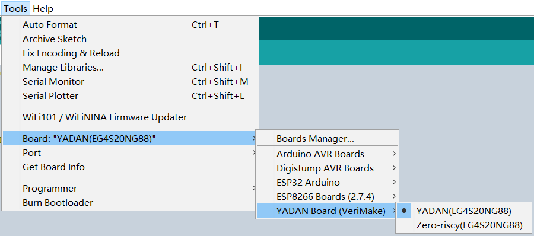
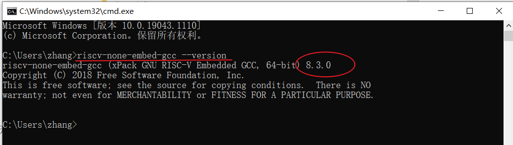
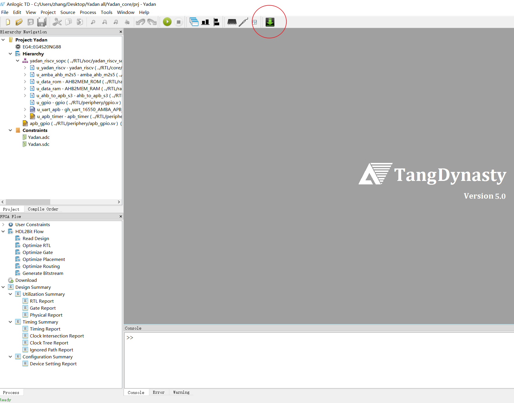
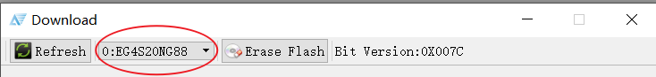

# 附录：超级快速入门步骤  
  
觉得前边的教程太长了？想二话不说就开始？  
  
假如你的电脑是 Windows 系统的，那也可以参考这一份附录，它能让你在已预先掌握前置知识的前提下，看完几页图文就快速上手 YADAN Board。  
  
## 搭建开发环境  
本实验所需的软件工具、源码等都在百度网盘中存了一份，可在这个地址中下载：
```
https://pan.baidu.com/s/1uzZ-Ic4XPclwRXgk5f-Z_g  提取码：3005
```
  
### 安装 TangDynasty (TD) 软件  
> 详细步骤可参考 [第 3.2 节](chap3.html#id2)。  
  
运行安装程序，根据提示操作即可完成。  
  
### 安装开发板的驱动程序  
> 详细步骤可参考 [第 3.3 节](chap3.html#id3)。  
  
使用 USB Type-C 线将 YADAN Board 连接至电脑上，打开 `设备管理器`，找到一个如图 6.1 所示的名为 `USB-JTAG-Cable` 的 USB 设备，未安装驱动时它会显示这个名字。  

**<center>  
图 6.1 未安装驱动的开发板在设备管理器中显示的名字</center>**  

鼠标右击它，选择 `更新驱动程序软件`，在弹出的选项中选择 `浏览计算机以查找驱动程序软件`，在弹出的文件选择框中选中 TD 软件安装路径下的 `driver` 目录，然后点击下一步，即可完成安装。  
  
操作完成后，若开发板通过 USB Type-C 线连接至电脑后被识别为如图 6.2 所示的 `Anlogic usb cable v0.1`，即表示驱动程序已经成功被安装。  
  
**<center>  
图 6.2 成功安装驱动程序后，设备管理器中显示的开发板名字</center>**


  
### 安装 Arduino IDE 并配置对 YADAN Board 的支持  
> 详细步骤可参考 [第 3.3 节](chap3.html#arduino-ide-yadan-board)。  
  
安装 Arduino IDE，打开它，然后打开 `File -> Preferences`，在 `Additional Boards Manager URLs` 中添加  
```
https://gitee.com/verimake/yadan_arduino/raw/master/package_verimake_core_index.json
```
然后打开 `Tools -> Board -> Boards Manager…` 搜索并安装如图 6.3 所示的 `YADAN`。（如果 Boards Manager 提示安装出错，可参考 [第 7.2 节](chap7.html#boards-manager-yadan)）  
  
**<center>  
图 6.3 在 Boards Manager 中安装 YADAN</center>**  
  
安装完成后即可在 `Tools -> Board` 中找到如图 6.4 所示的 `YADAN Board` 了。  
  
**<center>  
图 6.4 选择 Board</center>**  
  
### 安装 RISC-V GCC 工具链  
> 详细步骤可参考 [第 4.1 节](chap4.html#soc-fpga)。  
  
[The xPack GNU RISC-V Embedded GCC](https://github.com/xpack-dev-tools/riscv-none-embed-gcc-xpack) 是一种 Windows 下可用的 RISC-V GCC 工具链，我们以这个为例来介绍安装和使用步骤。  
  
下载它，解压到一个没有中文和特殊字符的路径下，将里边的 `bin` 文件夹的路径添加进环境变量，再在命令行中输入  
  
```
riscv-none-embed-gcc --version
```
  
如果能看到如图 6.5 所示的版本信息，即说明安装完成。  
  
**<center>  
图 6.5 验证工具链的安装</center>**  
  
## 使用 YADAN Board  
### 部署 SoC 至 FPGA  
> 详细步骤可参考 [第 4.1 节](chap4.html#soc-fpga)。  
  
综合好的 YADAN SoC 的 `.bit` 文件为 `Yadan.bit`，PULPino SoC 的为 `pulpino_zeroriscy.bit`，分别可在下边两个链接中找到。  
  
+ YADAN SoC: [https://gitee.com/verimake/yadansoc/tree/master/prj](https://gitee.com/verimake/yadansoc/tree/master/prj)
+ PULPino SoC: [https://pan.baidu.com/s/1uzZ-Ic4XPclwRXgk5f-Z_g](https://pan.baidu.com/s/1uzZ-Ic4XPclwRXgk5f-Z_g) (提取码: 3005, 在 “Zeroriscy内核开发工具” 文件夹中)
  
打开安装好的 TD 软件，点击如图 6.6 所示的按钮打开下载工具。  
  
**<center>  
图 6.6 TD 软件中打开下载工具的按钮</center>** 
  
将 YADAN Board 通过 Type-C USB 线与 PC 机相连，下载工具中原先显示 `No hardware` 的下拉框就会自动更新为 `EG4S20NG88`（如果加载不了需要检查下载器驱动是否正确安装，详情见 [第 3.3 节](chap3.html#id3)）。加载成功开发板后，界面如图 6.7 所示。  
  
**<center>  
图 6.7 下载工具加载成功开发板后的界面</center>**  
  
点击下载工具中的 `Add` 按钮，选中想下载进开发板的 `.bit` 文件。如果想断电不失，需在 `Mode Selection` 中把模式改为 `PROGRAM FLASH`。设置并检查好其它信息后，点击 `Run`，即可开始下载。  
  
### 使用 Arduino IDE 开发应用程序  
> 详细步骤可参考 [第 4.2 节](chap4.html#arduino-ide)。  
  
使用 Micro-USB 线将部署好 SoC 的开发板连接至电脑，电脑会读取到一个 UART 串口，我们可在设备管理器中看到名为 `USB-SERIAL CH340` 的这个串口，括号内即为该串口的 COM 号。如果没有看到串口号或显示未知设备，需要在百度网盘中或[沁恒官网的对应页面](http://www.wch.cn/products/CH340.html)下载 CH340 的驱动程序并安装。  
  
打开 Arduino IDE，根据之前部署的 SoC，在 `Tools -> Board` 中选择 `YADAN Board (VeriMake)` 中的 `YADAN` 或 `Zero-risky`。然后在 Port 中选择刚才查询到的 COM 号。  
  
需注意的是，原版 Arduino 是以 AVR 单片机为平台来开发的，但是我们使用的是 RISC-V 指令集的 SoC，所以不一定百分百兼容所有的 Arduino 函数。  
  
我们可以先参考 Arduino 的[基础示例](https://www.arduino.cc/en/Tutorial/BuiltInExamples)，跑个闪灯的 demo 来了解开发的整个流程。首先先填入下列代码（这份代码也可以在 Arduino IDE 的 `File -> Examples -> 01.Basics -> Blink` 中找到）
```
/*
  Blink
  Turns an LED on for one second, then off for one second, repeatedly.
  This example code is in the public domain: http://www.arduino.cc/en/Tutorial/Blink
*/

// the setup function runs once when you press reset or power the board
void setup() 
{
    // initialize digital pin LED_BUILTIN as an output.
    pinMode(LED_BUILTIN, OUTPUT);
}

// the loop function runs over and over again forever
void loop() 
{
    digitalWrite(LED_BUILTIN, HIGH);   // turn the LED on (HIGH is the voltage level)
    delay(1000);                       // wait for a second
    digitalWrite(LED_BUILTIN, LOW);    // turn the LED off by making the voltage LOW
    delay(1000);                       // wait for a second
}
```
  
代码中的 `LED_BUILTIN` 对应开发板上 GPIO 的第 13 号引脚，该引脚在电路中连接了一个 LED（原理图可参考[第 1.2.2 节](chap1.html#led)），这份代码将实现让这个 LED 亮一秒、灭一秒的无限循环。  
  
我们点击 `Upload` 按钮，IDE 即会自动开始编译程序、并下载至开发板。下载成功后，即可观察到开发板上的 LED 开始亮一秒、灭一秒的无限循环了，而且断电重新上电后程序依然还能执行。  
  
### 使用 RISC-V GCC 工具链从底层开发程序  
> 详细步骤可参考 [第 4.3 节](chap4.html#risc-v-gcc)。  
  
在之前从百度网盘下载的文件中，我们可以找到如图 6.8 所示的样例工程的文件夹，后续开发各种工程可以把它作为工程目录的模板。  
  
**<center>  
图 6.8 样例工程的文件夹</center>**
  
`file_c` 和 `file_s` 分别用于存放 C 代码和汇编代码，启动文件已位于 `file_s` 中，是目前 SoC 适用的一个完整版，后期我们编写的自己的 C 代码只需放入 `file_c` 目录即可。`libc.a ` 和 `libgcc.a` 是库文件，`link.ld` 是链接脚本，它将程序首地址定位在 0x0000_0000，RAM 定位在 0x0010_0000。  
  
比如，为了像前一节一样让 LED 闪烁，我们可以在 `file_c` 目录中创建一个 `main.c` 文件，然后填入以下代码
  
```
#define REG(add) (*(volatile unsigned int *)(add))  // 宏定义能让后边的代码更简短
#define PADDIR REG(0x4A10_1000)
#define PADOUT REG(0x4A10_1008)

int main()
{
    PADDIR = 1 << 13; // 设置 GPIO 的第 13 号引脚为输出模式

    while (1)         // 无限循环
    {
        PADOUT = 1 << 13;                // 设置 GPIO 的第 13 号输出高电平
        for (int i = 0; i < 300000; i++) // 软件延时
            ;
        PADOUT = 0 << 13;                // 设置 GPIO 的第 13 号输出低电平
        for (int i = 0; i < 300000; i++) // 软件延时
            ;
    }

    return 1;
}
```
  
我们提供了 Python 脚本 `wincompile.py` 用来处理 `file_c` 和 `file_s` 文件夹里的源码，它会将所有源码自动编译并生成最终的 `.bin` 机器码文件。这个脚本使用起来非常容易，我们只需在命令行中输入这一行命令  
  
```
python wincompile.py
```
  
即可运行它自动完成 “预处理 - 编译 - 汇编 - 链接” 这样的整个编译流程，生成最终的 `.bin` 机器码文件，`.bin` 文件被命名为 `simple.bin`。  
  
我们还提供有用于下载程序的上位机软件 （可在百度网盘中找到，上位机软件和 Bootloader 的源码也均可在百度网盘中找到），使用它可以很容易地完成下载过程。上位机软件使用 Python 编写，也生成了 exe 文件，有两种方式可以使用：
  
1. 如果安装有 Python 环境，可使用 Python 直接运行 `.py` 源文件
   ```
   python YADANdownload.py comX 115200 simple.bin A
   ```
2. 如果使用 exe 文件，则为
   ```
   YADANdownload.exe comX 115200 simple.bin A
   ```
  
其中，`comX` 的 `X` 表示 Windows 给已连接的开发板分配的串口号，需根据实际情况修改，`115200` 是 UART 的波特率，`simple.bin` 是需要下载的 `.bin` 文件的文件名，`A` 是个表示 `下载` 的功能标识，后续我们也可以添加其它字母来扩展更多功能。  
  
下载完成后，在开发板上也可以观察到 LED 在进行亮一秒、灭一秒的无限循环。
