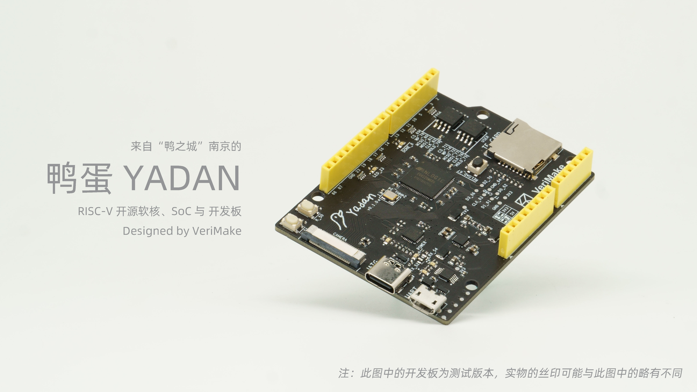

Welcome to YADAN Board's documentation!  
=========================================
欢迎访问鸭蛋开发板的简介与快速入门指南！  
=========================================

YADAN Board 是一块核心为 Anlogic FPGA 的可编程硬件设计学习平台，我们可在上边部署一颗 RISC-V 指令集的 YADAN Core 内核组成的 YADAN SoC，帮助我们从嵌入式软件一直学习到数字系统和计算机架构。

本文档正在更新中，部分内容暂时可能不完整，顺序或排版可能也存在问题，**推荐在几天后阅读正式版本**。

当前版本的更新时间为：2021年9月29日 UTC+8

如果您在使用 YADAN Board 的过程中遇到问题，欢迎在 `VeriMake 论坛 <https://www.verimake.com/>`_ 上参与讨论。如果发现文档中存在问题，欢迎在 `这个贴子 <https://verimake.com/topics/269/>`_ 下留言讨论。

.. toctree::
   :numbered:
   :maxdepth: 1
   :caption: 目录
   
   YADAN Board 开发板介绍 <YADAN_Board/chap1.md>
   已适配的 SoC 的介绍 (YADAN SoC / PULPino SoC)<YADAN_Board/chap2.md>
   搭建开发环境 <YADAN_Board/chap3.md>
   [待发布] 使用 YADAN Board <YADAN_Board/chap4.md>
   几个入门实验 <YADAN_Board/chap5.md>
   一些可能会遇到的问题 <YADAN_Board/chap6.md>
  

YADAN 在 RISC-V 中国峰会 2021 上的介绍
--------------------------------------------------

.. raw:: html

   <iframe src="https://player.bilibili.com/player.html?aid=546778671&bvid=BV19q4y1W7Jh&cid=373193875&page=1" scrolling="no" border="0" frameborder="no" framespacing="0" allowfullscreen="true"> </iframe>

点击 `此处 <https://www.bilibili.com/video/BV19q4y1W7Jh>`_ 在哔哩哔哩上看完整视频，点击 `此处 <https://space.bilibili.com/356383684>`_ 在哔哩哔哩上关注 VeriMake。  